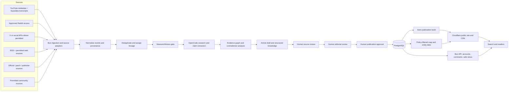
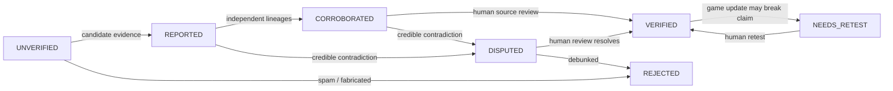

# Game Intelligence Platform Blueprint

**Human-reviewed AI gaming newsroom, structured knowledge platform, and interactive game-world publication**  
Version 2.1 — August 27, 2026  
_Open-source-first design. Docker-first deployment. Public sources only where permitted. Self-hostable core._

## Initial launch profile

The first launch profile is **Grand Theft Auto VI**, commonly written as **GTA VI** or **GTA 6**.

```text
canonical game ID: gta-vi
display name: Grand Theft Auto VI
aliases: GTA VI, GTA 6, Grand Theft Auto VI, Grand Theft Auto 6
```

The platform is an independent, unofficial fan publication and is not affiliated with, endorsed by, or sponsored by Rockstar Games or Take-Two Interactive. The project may discuss publicly circulated leaks as news subjects, but must not host, embed, reproduce, screenshot, transcode, display, or directly link to leaked game data or footage. Public citations for leak reporting must point to legitimate reporting or official responses. The project must not publish confidential or stolen material itself, DRM-bypass instructions, or third-party assets without appropriate rights.



_Figure 1. OpenCode researches and organizes information through a local newsroom runtime; humans control factual approval and publication; Astro publishes through Cloudflare; PostgreSQL stores the source of truth._

# 1. Executive Summary

Build a human-reviewed AI gaming newsroom and structured knowledge platform. It should detect genuinely newsworthy developments, compile information from permitted public sources, extract and verify claims, produce source-backed articles, maintain living canonical stories, and expose the same approved knowledge through an Astro website, account-aware safe views, an interactive game map, search, chat, and later clients.

The platform is not a high-volume AI content mill. Its primary objects are structured events, claims, evidence, discoveries, articles, revisions, entities, and map discoveries. AI performs research and information processing. Humans control truth and publication.

Initial publishing targets are approximately three substantial articles per week during normal periods and one to three substantial articles per day during major launch or news cycles. During low-news periods, the correct action is to publish nothing.

## Core product principles

- Evidence before virality: popularity is not proof.

- Lineage-aware corroboration: copied reports count as one source lineage, not many independent confirmations.

- Spoilers are policy, not merely labels: the server must redact or withhold unsafe details before rendering a user response.

- Cheap filters first, expensive AI last: deterministic rules, hashes, embeddings and compact classifiers should discard most noise before any large model is used.

- Source adapters are replaceable: YouTube, Reddit, social APIs, RSS and permitted website adapters all emit the same normalized SourceItem contract.

- Community participation is separate from editorial authority: standard users may comment and react to published pages, but engagement never verifies claims or grants publication access.

- Open-source code, separately governed publication data: anyone can inspect or self-host the software while the primary deployment operates its own evidence graph and editorial database.

- Game version and platform matter: every method can differ by PS5/Xbox/PC, patch, online/offline mode and story state.

- Human editorial control: AI and automated workers may not approve sources, certify claims, publish articles, publish corrections, or approve map discoveries.

- Content-first delivery: the public site should send fast, crawlable HTML and use client-side code only for concrete interactive features.

- Living stories over filler: when a new event belongs to an existing story, update that article rather than manufacturing a duplicate.

- One approved fact, many views: articles, entity pages, map markers, timelines, search, and future clients consume the same structured approved record.

- Safe personalization: account preferences are enforced by the backend before spoiler-sensitive content, comments, map markers, sources, or notifications are returned.

- Docker portability: development, alpha deployment, and future production deployment use the same container boundaries and Compose-compatible configuration.

## What “all free sources” means

Prefer official APIs, RSS/Atom feeds, public sitemaps, registered publisher pages, approved social APIs, Discord bot events, public wikis/forums where permitted, and explicitly authorized community material. “Free source” does not mean unrestricted legal permission, and a free provider plan may still impose quotas or terms. Publicly reported leaks may be discussed as news subjects, but leaked data or footage must never be hosted, embedded, reproduced or directly linked from a public article. YouTube transcripts are supplied by the Supadata adapter; the project does not run a local transcription service. Each adapter must have a policy profile, rate limiter and kill switch. The architecture supports crawling registered sources when enabled by policy.

# 2. Document Map

- 3. Scope and non-goals

- 4. System architecture

- 5. Recommended open-source stack

- 6. Core data model

- 7. Ingestion framework

- 8. YouTube ingestion and Supadata transcript adapter

- 9. Reddit ingestion

- 10. Discord and web community ingestion

- 11. Game journalism, wiki and forum ingestion

- 12. Spam, quality and relevance filtering

- 13. Claim extraction and normalization

- 14. Deduplication and provenance lineage

- 15. Verification and confidence engine

- 16. Community features and anti-abuse controls

- 17. Spoiler engine

- 18. Glitch/exploit risk engine

- 19. Editorial roles and staff workflow

- 20. Publishing and personalization

- 21. LLM chat / RAG architecture and OpenCode SDK execution

- 22. Astro website, profiles and interactive map

- 23. Notifications

- 24. iPhone and Android apps

- 25. Public API and developer platform

- 26. Jobs, queues and event contracts

- 27. Security, privacy and abuse prevention

- 28. Observability and operations

- 29. Scaling plan

- 30. Repository layout

- 31. Deployment / Docker Compose

- 32. Testing strategy

- 33. Implementation roadmap

- 34. Launch and community strategy

- 35. Open-source governance

- 36. Platform constraints and compliance matrix

- 37. Reference sources

- 38. Definition of Done

# 3. Scope and Non-Goals

## In scope

- Near-real-time detection of genuinely newsworthy developments for supported games, including announcements, trailers, mechanics, locations, vehicles, characters, missions, releases, patches, public reporting about leaks and community discoveries.

- Source ingestion from YouTube metadata plus Supadata transcripts, approved Reddit access, permitted social APIs, official sources, RSS/sitemaps and permitted websites.

- Structured event, claim, evidence, discovery, article, revision, entity and map data with provenance, confidence, contradiction handling, version/platform tagging and patch invalidation.

- A human-reviewed newsroom that researches, drafts, fact-checks and publishes only after source review and editorial approval.

- Living canonical articles that are updated when a story develops rather than duplicated into low-value posts.

- Game-specific profiles for ontology, terminology, progression, spoiler policy, exploit policy, map coordinates, platforms, builds and source configuration.

- Per-user spoiler and exploit controls based on a game profile, progress state and manually selected sensitivity.

- Accounts, public profiles, comments, likes and dislikes on published pages. Staff role badges are post-V1.

- A local operator workflow for source review, editorial review, publication approval and audit logs. Web staff screens, staff APIs and server-enforced multi-role RBAC are post-V1 extensions.

- Astro publication pages, SEO metadata, entity pages, location pages, timelines, search, a structured interactive game map and account-aware safe views.

- Cloudflare delivery for the public Astro site plus a local Docker Compose newsroom with Bun services, PostgreSQL, optional Valkey, Cloudflare R2 storage and optional private Cloudflare Tunnel API ingress.

- Public read APIs with scoped authentication and rate limits. Local operator APIs are private to the Compose network; web staff APIs and native mobile clients are deferred until after web adoption.

## Explicit non-goals

- Training a foundation model on third-party scraped content. Retrieval and transient analysis are sufficient for this product.

- Autonomous publication. AI may research and draft, but humans must control source approval, editorial approval, publication and corrections.

- Local audio or video transcription. YouTube transcript retrieval is delegated to Supadata; manual fixture transcripts remain available for testing.

- Circumventing platform access controls, paywalls, authentication gates, CAPTCHAs, DRM or rate limits, or providing instructions for obtaining leaked material.

- Archiving full copyrighted articles/videos when only a small evidence excerpt, metadata and canonical URL are needed.

- Providing instructions for account theft, malware, DDoS, real-world fraud, credential abuse, harassment, or other harmful/security-abuse behavior.

- Treating an LLM confidence score as truth. Truth comes from evidence and reproducibility, with AI assisting organization and classification.

# 4. System Architecture

Use an event-driven newsroom pipeline. Every stage writes durable records before handing work to the next stage. This makes the system replayable, auditable and resilient to model, parser, source-policy and editorial changes. Several logical services may initially run together in one or two Docker containers.

## Logical services

| **Service**           | **Responsibility**                                                                                 | **Scale independently?**   |
| --------------------- | -------------------------------------------------------------------------------------------------- | -------------------------- |
| ingest-gateway        | Receives adapter events and webhooks; validates schemas; stores source metadata.                   | Yes                        |
| source-workers        | YouTube, Supadata, Reddit, social API, RSS, crawler and official-source adapters.                  | Yes                        |
| preprocessor          | HTML cleanup, language detection, URL normalization, spam rules, fingerprints and cheap relevance. | Yes                        |
| newsworthiness-worker | Scores events and decides ignore, update-existing or research-new-article.                         | Yes                        |
| research-worker       | Collects permitted sources, retrieves context and prepares research packets.                       | Yes                        |
| extraction-worker     | Turns source text into typed claims, evidence references and entity candidates.                    | Yes                        |
| clusterer             | Finds equivalent or related claims and assigns provenance lineage.                                 | Yes                        |
| verification-engine   | Computes evidence confidence, contradictions, patch decay and review requirements.                 | Yes                        |
| editorial-service     | Drafts, revisions, source reviews, editor reviews, approvals, corrections and audit logs.          | Yes                        |
| policy-engine         | Spoiler, exploit, account-profile and safe-view policy enforcement.                                | Yes                        |
| api-gateway           | REST, SSE/WebSocket, authentication, rate limits, comments and reactions.                          | Yes                        |
| publisher-worker      | Validates approved revisions, creates public publication artifacts and triggers Astro builds.      | Yes                        |
| map-indexer           | Projects approved entities and locations into policy-filtered map data.                            | Yes                        |
| chat-service          | Retrieval tools and safe-view response composition without publication authority.                  | Yes                        |
| web-app               | Astro public publication, account shell, entity pages and interactive islands.                     | Cloudflare / local preview |
| OpenCode runtime      | Local host agent runtime used by newsroom workers for research, extraction and drafting.           | Host process               |

## Event lifecycle

```text
source.detected
  -> source.normalized
  -> source.relevance_scored
  -> transcript.requested (Supadata, when eligible)
  -> event.deduplicated
  -> newsworthiness.scored
  -> ignore OR update_existing OR research_requested
  -> claim.extracted
  -> claim.clustered
  -> evidence.attached
  -> discovery.score_recomputed
  -> article.drafted
  -> source_review.required
  -> source_review.completed
  -> editor_review.completed
  -> human_publication.approved
  -> publication.build_requested
  -> article.published / article.updated
```

# 5. Recommended Open-Source Stack

A Bun and TypeScript monorepo matches a content-first Astro publication and a backend newsroom. Hosted services can be substituted later, while Docker Compose remains the reproducible baseline.

| **Layer**              | **Recommended**                                     | **Why**                                                                             |
| ---------------------- | --------------------------------------------------- | ----------------------------------------------------------------------------------- |
| Monorepo               | Bun workspaces + optional Turborepo                 | Fast shared TypeScript schemas, API, newsroom and Astro tooling.                    |
| Public web             | Astro + TypeScript + CSS/Tailwind                   | Content-first static HTML, metadata, structured data and small client islands.      |
| Frontend interactivity | Vanilla TypeScript + Leaflet                        | Keep React out of V1 while supporting the interactive game map.                     |
| API/newsroom           | Bun + Hono or Elysia                                | One runtime for typed APIs, workers and editorial automation.                       |
| Schema/validation      | Zod + JSON Schema/OpenAPI                           | Shared contracts across adapters, workers, local operator tools and future clients. |
| Database               | PostgreSQL 17+                                      | Articles, claims, evidence, editorial workflow, accounts and map knowledge.         |
| Vectors                | pgvector                                            | Avoid a second vector database until scale forces it.                               |
| Full-text search       | PostgreSQL FTS initially; Meilisearch later         | Simple launch path with a clear scale-out option.                                   |
| Queue/cache            | PostgreSQL jobs; Valkey when needed                 | Avoid infrastructure that is not required by the initial publishing cadence.        |
| Object storage         | Cloudflare R2                                       | S3-compatible media and evidence storage with a useful free allowance.              |
| Crawler                | undici/fetch + Mozilla Readability; Playwright last | Static-first retrieval and permitted rendering only.                                |
| YouTube transcripts    | Supadata adapter                                    | External transcript provider; no local transcription service.                       |
| Embeddings             | Configured local or provider embedding model        | Claim clustering and retrieval behind a replaceable interface.                      |
| AI runtime             | OpenCode host runtime + `@opencode-ai/sdk/v2`       | Local agent orchestration with explicit `openai/gpt-5.6-luna` model selection.      |
| Authentication         | Bun-owned sessions with passkeys/OAuth where needed | GitHub or static hosting must not own account security.                             |
| Observability          | OpenTelemetry + Prometheus + Grafana + Loki         | Vendor-neutral metrics, traces and logs.                                            |
| Error tracking         | GlitchTip or Sentry-compatible self-hosting         | Open-source issue and error visibility.                                             |
| Deployment             | Cloudflare public site + local Docker Compose       | Cloudflare serves Astro; Compose runs the private API, database and newsroom.       |
| Native mobile          | Deferred                                            | The web publication is the first product; future clients consume the same API.      |

# 6. Core Data Model

Do not make an article, post, or video the only canonical object. The factual layer is a Discovery composed of Claims and Evidence. The editorial layer is an Article with immutable revisions that references approved discoveries, claims and sources. The knowledge layer projects approved facts into entities, locations, timelines and map discoveries.

## Primary entities

| **Entity**        | **Key fields**                                                                                                                                                  |
| ----------------- | --------------------------------------------------------------------------------------------------------------------------------------------------------------- |
| Game              | id, canonical_name, aliases, public_slug, capabilities, active, profile_version                                                                                 |
| GameProfile       | game_id, ontology, terminology, progression model, spoiler rules, exploit rules, map configuration, source registry, version                                    |
| GameBuild         | id, game_id, platform, mode, region, version, released_at, active                                                                                               |
| Source            | id, type, canonical_url, public_citation_url, source_strength, source_reliability_adjustment, publication_mode, account/channel/domain, policy_profile, enabled |
| SourceItem        | id, source_id, game_id, external_id, URL, title, text/transcript pointer, source_strength, provenance_status, public_visibility, timestamps, raw_hash           |
| Event             | id, game_id, source_item_ids, event_type, novelty, detected_at, existing_article_id, newsworthiness_score, disposition                                          |
| Claim             | id, game_id, normalized_subject, predicate, object/value, qualifiers, platform, build, progression_context, source spans                                        |
| Discovery         | id, game_id, canonical_title, category_id, summary, status, confidence, first_seen_at, verified_at, last_validated_at                                           |
| Evidence          | id, discovery_id, claim_id, source_item_id, stance, evidence_type, timestamp/quote span, lineage_id, weight                                                     |
| Reproduction      | id, discovery_id, actor_id, outcome, platform, game_build, steps_hash, notes, proof_attachment_id                                                               |
| Article           | id, game_id, slug, title, body, status, newsworthiness, article_sources_complete, published_at, updated_at, approved_by, approved_at                |
| ArticleRevision   | id, article_id, revision_number, body, metadata, editor_id, created_at, change_summary                                                                          |
| ArticleSource     | article_id, source_id, claim_id, citation_label, public_citation_url, review_status, reviewed_by, reviewed_at, visibility                                       |
| Entity            | id, game_id, type_id, canonical_name, aliases, spoiler_profile, status                                                                                          |
| Location/MapLayer | id, game_id, name, coordinate_system, map_asset_key, visibility_policy                                                                                          |
| MapDiscovery      | id, game_id, map_layer_id, entity_id, coordinates, status, confidence, source_review_id, article_id                                                             |
| SourceReview      | id, source_id, reviewer_id, approved, source_strength_confirmed, credibility_rating, publication_decision, notes, reviewed_at                                   |
| ClaimReview       | id, claim_id, reviewer_id, classification, verified, notes, reviewed_at                                                                                         |
| ArticleReview     | id, article_id, reviewer_id, decision, notes, completed_at                                                                                                      |
| User              | id, handle, display_name, avatar_key, role, status, created_at                                                                                                  |
| UserGameProfile   | user_id, game_id, spoiler mode, progression state, allowed categories, exploit mode, platform/build, confidence threshold, revision                             |
| Comment           | id, author_id, target_type, target_id, body, spoiler_profile, moderation_status, created_at, updated_at                                                         |
| PageReaction      | user_id, target_type, target_id, reaction, created_at                                                                                                           |
| RoleAudit/Action  | actor_id, target_id, old_role, new_role, action, reason, timestamp                                                                                              |
| PublishJob        | id, article_id, revision_id, status, idempotency_key, artifact_key, started_at, completed_at                                                                    |
| Notification      | user_id, discovery/article_id, rule_id, channel, status, sent_at, dedupe_key                                                                                    |
| Media             | id, game_id, r2_key, visibility, content_type, checksum, attribution, retention_until                                                                           |

## Example typed discovery contract

```ts
type GameProfile = {
  id: string;
  canonicalName: string;
  aliases: string[];
  version: string;
  capabilities: {
    story: boolean;
    progression: boolean;
    onlineMode: boolean;
    map: boolean;
  };
};

type UserGameProfile = {
  userId: string;
  gameId: string;
  spoilerMode:
    | "strict"
    | "progress_aware"
    | "topic_safe"
    | "reveal_on_click"
    | "unfiltered";
  progressionState: unknown | null;
  allowedCategories: string[];
  exploitMode: string;
  platform: string | null;
  gameBuild: string | null;
  minimumConfidence: number;
  revision: number;
};

type Discovery = {
  id: string;
  gameId: string;
  gameProfileVersion: string;
  titleSafe: string;
  categoryId: string;
  status:
    | "unverified"
    | "reported"
    | "corroborated"
    | "verified"
    | "needs_retest"
    | "disputed"
    | "patched"
    | "rejected";
  confidence: number; // 0..1, evidence-derived
  newsworthiness: number; // 0..100, editorial triage only
  platforms: string[];
  gameBuilds: string[];
  progressionContext: unknown | null;
  firstSeenAt: string;
  lastValidatedAt: string | null;
  spoiler: SpoilerProfile;
  exploit: ExploitProfile;
  claims: Claim[];
  evidenceSummary: EvidenceSummary;
};

type Article = {
  id: string;
  gameId: string;
  slug: string;
  title: string;
  seoTitle: string;
  description: string;
  body: unknown;
  status:
    | "draft"
    | "source_review"
    | "editor_review"
    | "approved"
    | "published"
    | "updated"
    | "retracted";
  newsworthiness: number;
  sourceReviewCompleted: boolean;
  editorReviewCompleted: boolean;
  articleSourcesComplete: boolean;
  sourceRefs: ArticleSource[];
  approvedBy: string | null;
  publishedAt: string | null;
  updatedAt: string | null;
};
```

# 7. Ingestion Framework

## Adapter contract

Every source adapter implements the same interface. The rest of the platform must not care whether content came from RSS, an approved API, a permitted crawler, an official source or a manual fixture. Adapters resolve one or more supported game profiles before producing events.

```ts
interface SourceAdapter {
  id: string;
  policy: SourcePolicy;
  supportedGameIds: string[];
  discover(cursor?: string): AsyncIterable<DiscoveredRef>;
  fetch(ref: DiscoveredRef): Promise<NormalizedSourceItem>;
  healthCheck(): Promise<AdapterHealth>;
}

type SourcePolicy = {
  accessMode:
    "official_api" | "rss" | "permitted_scrape" | "provider_api" | "manual";
  requestsPerMinute: number;
  retainRawTextDays: number;
  mayStoreFullText: boolean;
  attributionRequired: boolean;
  termsReviewedAt: string | null;
};
```

## Source strength hierarchy

Source strength is a game-agnostic triage and reliability classification. It is not human verification and never overrides provenance, contradiction handling, source policy, spoiler policy, exploit policy or publication visibility.

```ts
type SourceStrength =
  | "PRIMARY"
  | "DIRECT_EVIDENCE"
  | "TRUSTED_SECONDARY"
  | "COMMUNITY"
  | "UNVERIFIED";
```

| **Rank** | **Strength**        | **Examples**                                                                                                  |
| -------- | ------------------- | ------------------------------------------------------------------------------------------------------------- |
| 1        | `PRIMARY`           | Rockstar, Take-Two, SEC filings, official trailers and official patch notes.                                  |
| 2        | `DIRECT_EVIDENCE`   | Original gameplay capture, datamining, developer interview or a creator personally demonstrating a discovery. |
| 3        | `TRUSTED_SECONDARY` | Established GTA YouTuber, reputable gaming publication, known researcher or known modder.                     |
| 4        | `COMMUNITY`         | Reddit, GTAForums, Discord or X posts.                                                                        |
| 5        | `UNVERIFIED`        | Anonymous accounts, reposts or screenshots without provenance.                                                |

The examples are launch-profile examples; each game profile may add equivalent publisher, regulator, creator and community sources without changing the hierarchy. A source adapter may assign an initial strength, but a human review record must be able to confirm, downgrade or dispute it. Copied sources retain the earliest identifiable `lineage_id` and do not count as independent corroboration.

## Leak and pre-release material policy

The newsroom may discuss publicly circulated leaked game data or footage as a news subject. Discussion must be clearly labeled as leaked, unverified or otherwise disputed when appropriate. The project must not host, upload, mirror, embed, screenshot, transcode, display, provide download instructions for, or directly link to the leaked asset.

Public article citations for leak reporting must point to legitimate journalism, a permitted public source discussing the leak, or an official response. The original leak URL may be retained for local review as `reviewer_only` source metadata, but it must not be emitted in public HTML, feeds, APIs, notifications, media, thumbnails or search indexes. A leak's source strength and its public visibility are separate fields: established provenance may support `DIRECT_EVIDENCE`, while an anonymous or unsupported leak remains `UNVERIFIED`.

Source policy stores a separate `publication_mode`: `normal`, `discussion_only` or `blocked`. Leak-related source items use `discussion_only` unless a policy review requires `blocked`; neither mode permits the underlying leaked asset to enter public output.

## Game profile resolution

The platform core must never use a hardcoded game name or keyword list. A resolver maps source titles, descriptions, entities and aliases to a registered `game_id`. Ambiguous or cross-game material is held for review rather than being assigned silently.

Each game profile supplies its own ontology, aliases, source queries, progression vocabulary, spoiler dimensions, exploit policy, platform/build vocabulary and map coordinate system. The initial `gta-vi` profile is one configuration, not a special code path.

## Source discovery order

1.  RSS/Atom/webhooks first: cheapest and lowest-friction.

2.  Official API second: structured metadata and predictable identifiers.

3.  Sitemaps/category pages third: detect URLs, then fetch only new items.

4.  Permitted HTML crawling fourth: fetch only changed/new pages, cache ETag/Last-Modified, and respect source-specific pacing.

5.  Headless browser last: only if a permitted source requires client rendering and static HTTP cannot retrieve the content.

6.  Manual fixtures and explicitly approved local operator inputs may enter through validation; ordinary account comments and reactions are never treated as evidence.

## Raw retention strategy

Keep only what is necessary for verification and reprocessing. Store canonical URLs, hashes, metadata, evidence spans, derived claims and short excerpts. For third-party articles and provider-supplied transcripts, avoid indefinite full-copy retention unless the source license and provider terms permit it. Re-fetch the canonical source when needed. Store approved media in R2 with explicit visibility and retention controls.

# 8. YouTube Ingestion and Supadata Transcript Adapter

Use the YouTube Data API for metadata, channel/video discovery and canonical source links. Query terms, channels and game aliases must come from the active game profile rather than being hardcoded in the adapter. Respect the API quota and stop or degrade gracefully when the configured budget is exhausted. [2]

## YouTube discovery strategy

- Maintain a curated list of high-signal channels for each supported game and poll upload/feed metadata before spending quota on broad search.

- Store profile-defined search terms and aliases, such as the initial `gta-vi` profile's approved GTA VI terminology.

- Use published timestamps and persistent cursors to avoid re-processing old results.

- Run title, description, channel reputation and game-profile relevance through cheap filters before requesting a transcript.

- Treat video comments as optional, low-priority source items. Reposts and copied comments never count as independent confirmation.

## Caption and transcript constraint

The official YouTube Captions download method is not a general public-transcript API: Google states that `captions.download` requires authorization and permission to edit the video. [3] The project will not bypass that restriction and will not run a local audio/video transcription service.

For eligible YouTube videos, transcript retrieval is delegated to Supadata through a replaceable provider adapter. Supadata availability, quotas and terms are configuration concerns, not assumptions in the core pipeline. A failed or rate-limited transcript request must not block metadata-only event detection.

## Transcript provider contract

```ts
interface TranscriptProvider {
  id: string;
  getTranscript(input: {
    videoId: string;
    language?: string;
  }): Promise<TranscriptResult>;
  healthCheck(): Promise<ProviderHealth>;
}

type TranscriptResult = {
  provider: string;
  providerVersion: string;
  videoId: string;
  language: string | null;
  segments: Array<{
    startMs: number;
    endMs: number;
    text: string;
  }>;
  sourceHash: string;
};
```

The first provider is:

| **Provider** | **Use**                                          | **Rules**                                                                                                                                         |
| ------------ | ------------------------------------------------ | ------------------------------------------------------------------------------------------------------------------------------------------------- |
| supadata     | Transcript retrieval for eligible YouTube videos | API key remains server-side; call only after relevance filtering; cache by video, language and provider version; observe current quota and terms. |

Manual transcript text and timestamped fixture files may be used in development. They are test inputs, not an automated production transcription path.

## YouTube Transcript/API Playground

Ship a local operator diagnostic command or SDK task for debugging the provider and extraction pipeline. It is not a public web page and must not expose API keys, unrestricted source retrieval, or private transcript storage to standard users.

```text
newsroom youtube inspect <url-or-video-id>
newsroom youtube transcript <url-or-video-id>
newsroom youtube extract <source-item-id>
newsroom youtube policy-preview <article-id>

Input:
YouTube URL or video ID
[ ] metadata only
[ ] request Supadata transcript
extraction model: openai/gpt-5.6-luna through OpenCode
game profile: gta-vi / another registered profile
spoiler policy: strict / custom

Panels:
1. YouTube metadata response
2. Supadata transcript with timestamps
3. Extracted claims JSON
4. Similar existing discoveries and articles
5. Evidence and lineage decision
6. Spoiler and exploit tags
7. Final spoiler-safe article preview
8. Provider status, latency, quota and cache counters
```

### Local operator endpoints

```http
POST /internal/operator/youtube/inspect
POST /internal/operator/youtube/transcript
POST /internal/operator/youtube/extract
POST /internal/operator/youtube/cluster
POST /internal/operator/youtube/policy-preview
GET  /internal/operator/jobs/:jobId/events  # SSE progress stream
```

These endpoints are private to the local Compose network and are an implementation detail, not a V1 public API or staff interface.

## Transcript processing

1.  Request metadata and run game-profile relevance scoring.

2.  Request a Supadata transcript only for a relevant candidate.

3.  Preserve provider timestamps and calculate a transcript hash.

4.  Chunk by semantic boundaries, not arbitrary token counts.

5.  Extract only candidate claims and exact supporting timestamps.

6.  Do not ask the LLM for a generic summary first; claim extraction is more compact and auditable.

7.  Store provider version and source hash so claims can be reprocessed without repeating an unchanged request.

8.  Retain only permitted excerpts, hashes and derived evidence references unless the provider and source terms allow more.

9.  If a video or transcript is later removed, preserve derived review metadata according to policy but avoid redistributing the full transcript.

# 9. Reddit Ingestion

Treat Reddit as a replaceable, policy-sensitive adapter. Reddit’s June 2026 Responsible Builder Policy says API access requires explicit approval and bars unauthorized scraping; Reddit also announced a longer-term migration toward its Developer Platform, though broader restrictions were not planned to take effect during 2026. [1][4]

## Recommended implementation

- Create reddit-approved adapter using OAuth/API/Devvit capabilities that your approved use case permits.

- Subscribe only to relevant communities and actions; avoid collecting unnecessary user profile data.

- Ingest new posts plus comments only for candidate/high-signal threads.

- Hash canonical URLs/external IDs so later re-fetches update existing SourceItems rather than create duplicates.

- Store author identifiers only when needed for anti-spam/reputation and permitted by policy; avoid cross-platform identity linking.

- Keep a source adapter feature flag so Reddit can be disabled without affecting the rest of the system.

## What to extract from a Reddit thread

POST CLAIM: "vehicle X spawns here before mission Y"  
├─ comment: confirms on PS5  
├─ comment: failed on Xbox  
├─ comment: requires nighttime  
├─ comment: links video proof  
└─ moderator note: duplicate of older discovery

Result: one discovery with multiple evidence events, not five feed items.

# 10. Discord and Web Community Ingestion

## Discord bot

Start with slash commands and explicitly selected messages from authorized channels rather than silently reading every server message. Discord’s `MESSAGE_CONTENT` intent is privileged; message context commands and mentions can provide selected content without broad passive scanning. [5]

Discord is an optional source adapter and community distribution channel. It does not grant a Discord user editorial permissions, and Discord messages are not treated as verified evidence without the same source review and editorial workflow used everywhere else.

## Web community surface

The initial website account model is intentionally narrower than the original contributor model:

- Standard users may read published content, comment, like and dislike published pages.

- Standard users cannot submit evidence, confirm discoveries, dispute claims, edit articles or publish.

- The local operator may add or correct evidence through the private editorial workflow; future staff may do so through authenticated editorial tools.

- Comments and reactions are engagement data, not evidence and never change factual confidence or publication approval.

- Comment bodies receive moderation and spoiler classification before being shown to users whose profiles would block them.

- Rate limits, duplicate detection, abuse reports and moderation status apply to comments and reactions.

# 11. Game Journalism, Wiki and Forum Ingestion

## Preferred discovery order

- RSS/Atom feeds

- XML sitemaps

- category/tag archive pages

- permitted article pages

- forum APIs/RSS where available

- headless rendering only when necessary and allowed

## Article parser pipeline

```text
URL detector
-> source policy check
-> conditional GET (ETag / Last-Modified)
-> HTML parser
-> Mozilla Readability
-> sanitizer
-> boilerplate/affiliate removal
-> relevance filter
-> claim extractor
-> retain evidence spans + canonical URL
```

Mozilla Readability is open source (Apache-2.0) and provides the same style of main-article extraction used by Firefox Reader View; its documentation explicitly recommends sanitizing untrusted output before rendering it. [6]

## Publisher source registry

```yaml
sources.yaml
- id: example-gaming-site
  game_ids: [gta-vi]
  domains: ["example.com"]
  access: permitted_scrape
  source_strength: TRUSTED_SECONDARY
  rpm: 6
  discover:
    rss: "https://example.com/gaming/rss"
    sitemap: "https://example.com/sitemap.xml"
  retain_full_text_days: 2
  attribution: required
  public_citation: required
  terms_reviewed_at: "2026-08-27"
  enabled: true
```

# 12. Spam, Quality and Relevance Filtering

The cheapest layers should eliminate the majority of content before any large-model call. Newsworthiness is an editorial triage signal, not a truth score. User likes and dislikes may provide a weak reader-interest signal but must never increase claim confidence.

## Layer A: deterministic rejection

- Wrong game/title/language (unless translation is supported).

- Exact URL/content hash already processed.

- Known ad/affiliate boilerplate, giveaway spam, unrelated reaction/meme content.

- Repeated comments or reactions from the same identity/IP/device pattern beyond rate limits.

- Malformed links, executable attachments, unsupported media, obvious phishing domains.

- Known content farms or sources blocked by source policy or future moderators.

## Layer B: cheap relevance score

```text
newsworthiness =
  source_authority * 0.18
  + novelty * 0.18
  + reader_usefulness * 0.16
  + game_relevance * 0.14
  + new_information * 0.14
  + confirmation_strength * 0.10
  + community_interest * 0.05
  + search_interest * 0.05

if newsworthiness < 0.30 -> ignore or archive metadata only
0.30..0.60 -> monitor, enrich, or consider an existing article update
> 0.60 -> research queue
```

After scoring, the event receives one editorial disposition:

```text
ignore
update_existing
research_new_article
```

The threshold and weights are profile- and publication-policy configuration. A high score never bypasses source review or editorial approval.

## Layer C: spam model features

- Near-duplicate title/body across many domains.

- Sensational numerics that conflict with body evidence.

- Source repeatedly deletes/reposts claims.

- Evidence links all trace to the same upstream claim.

- Impossible game-state assertions based on known progression graph.

- Community flags and local operator or future moderator actions.

- Historical source accuracy, capped so reputation cannot override contrary evidence.

# 13. Claim Extraction and Normalization

Extraction models never decide “true.” Their job is to turn prose into candidate statements that can be tested against other evidence.

```json
{
  "game_id": "gta-vi",
  "game_profile_version": "1",
  "subject": { "type": "vehicle", "name": "unknown_high_end_car" },
  "predicate": "obtainable_at",
  "object": { "location": "parking_garage_12" },
  "qualifiers": {
    "time_of_day": "night",
    "progression_max_state": "mission_04",
    "platform": "PS5"
  },
  "evidence": {
    "source_item_id": "src_...",
    "start_ms": 372000,
    "end_ms": 408000,
    "text_span_hash": "..."
  },
  "spoiler_candidates": ["location:parking_garage_12"],
  "exploit_candidates": []
}
```

## Extraction rules

19. One atomic claim per output object.

20. Separate observation from inference. “I found it here” is evidence; “it always spawns here” is a stronger claim requiring additional proof.

21. Capture conditions: time, weather, mission state, wanted level, inventory, platform, online/offline, game build.

22. Capture uncertainty explicitly.

23. Never discard contradictory statements; emit them as opposing evidence.

24. Link every extracted claim to a source span/timestamp so the local operator or future moderators can inspect the exact evidence.

# 14. Deduplication and Provenance Lineage

## Two different questions

- Is this text/post/video a duplicate SourceItem?

- Is this Claim equivalent to, a refinement of, or contradictory to an existing Claim?

## Lineage graph

If IGN, three Reddit posts and a YouTube video all cite the same original clip, they belong to one evidence lineage. They can improve accessibility/context but must not create five independent corroboration votes.

```text
lineage_id = earliest identifiable upstream evidence

Independent evidence requires at least one of:
- different original capture/proof
- independent reproduction with conditions recorded
- independently observed game data
- authoritative official documentation / patch notes

Reposts, reactions, and articles that only repeat the same upstream claim:
- contribute context/reach
- contribute ~0 independent verification weight
```

# 15. Verification and Confidence Engine



_Figure 2. Discovery transitions are evidence-driven, human-reviewed and reversible. Automated scoring may recommend a state but cannot make a claim publicly verified._

## Source strength input

Use the hierarchy as one bounded input to confidence scoring, never as a substitute for evidence review. The initial values are illustrative and must remain versioned so scores can be recomputed when the policy changes.

| **Source strength** | **Illustrative prior** | **Rule**                                                                                 |
| ------------------- | ---------------------- | ---------------------------------------------------------------------------------------- |
| `PRIMARY`           | +0.30                  | Strong authority for publisher intent, release status and documented patch behavior.     |
| `DIRECT_EVIDENCE`   | +0.24                  | Strong observable evidence when provenance and conditions are inspectable.               |
| `TRUSTED_SECONDARY` | +0.16                  | Useful independent reporting or testing; confirm that it is not merely repeating a leak. |
| `COMMUNITY`         | +0.08                  | Candidate evidence and leads; require corroboration or reproduction for routine claims.  |
| `UNVERIFIED`        | +0.00                  | May motivate research, but cannot establish public verification by itself.               |

Source-specific reliability adjustments must stay within the configured strength bound. A public report about a leak can support a claim about what was reported, but it does not make the leaked game detail true without independent evidence.

## Evidence types and starting weights

| **Evidence**                             | **Illustrative weight** | **Notes**                                                      |
| ---------------------------------------- | ----------------------- | -------------------------------------------------------------- |
| Independent reproduction with proof      | +0.25                   | Strongest routine evidence; conditions must match.             |
| Independent reproduction without proof   | +0.12                   | Useful only when recorded and reviewed; never a reaction vote. |
| Video showing full method/result         | +0.20                   | Check edit cuts and game build.                                |
| Screenshot/log with clear state          | +0.08                   | Weaker than full reproduction.                                 |
| Trusted publication independently tested | +0.18                   | Only if it reports its own test, not a repost.                 |
| Official patch notes/docs                | +0.35                   | Authoritative for intended mechanics/patch status.             |
| Independent failure to reproduce         | -0.15                   | Condition-aware; may reveal missing requirement.               |
| Strong contradiction with proof          | -0.25                   | Moves claim toward disputed.                                   |
| Copied/reposted claim                    | +0.00 to +0.02          | Do not reward virality as truth.                               |

Weights are starting heuristics, not sacred constants. Store raw evidence and recompute scores whenever the formula changes.

## Confidence computation

```text
base = source_strength_prior(claim.first_source)
  + source_specific_adjustment(claim.first_source)
independent = sum(capped_weight(e) for unique_lineages)
reproduction = weighted_success_rate(approved_reproductions)
contradiction = sum(negative_weight(e) for credible_contradictions)
recency = version_recency_factor(current_build, evidence_build)
condition_quality = condition_completeness_score(claim)

logit = -1.4 + base + independent + reproduction + contradiction
+ 0.35*condition_quality
confidence = sigmoid(logit) * recency

Hard rules:
- Automated confidence never grants public VERIFIED status.
- VERIFIED requires an authorized human reviewer to review the relevant source and evidence. In V1 that reviewer is the local operator; moderator and admin roles are post-V1.
- One lineage alone cannot establish a routine claim unless the source is authoritative and a human approves it.
- An `UNVERIFIED` source or leak report cannot establish a publicly `VERIFIED` game claim by itself.
- A new patch can automatically downgrade VERIFIED -> needs_retest.
- A local operator, moderator or admin decision changes state but never deletes underlying evidence.
- User likes, dislikes and comments never affect factual confidence.
```

## Status thresholds (initial)

| **State**          | **Rule of thumb**                                                                        |
| ------------------ | ---------------------------------------------------------------------------------------- |
| UNVERIFIED         | Candidate evidence has not met the corroboration or review requirements.                 |
| REPORTED           | Multiple reports exist but independence or evidence is insufficient.                     |
| CORROBORATED       | Independent lineages support the claim, but human verification is incomplete.            |
| VERIFIED           | Required evidence was reviewed and approved by an authorized human reviewer.             |
| NEEDS_RETEST       | A build, platform, mode or condition changed and the prior result needs human retesting. |
| DISPUTED           | Material credible contradiction or inconsistent conditions remain unresolved.            |
| PATCHED / OBSOLETE | Human-reviewed evidence indicates the claim no longer applies to the active build.       |
| REJECTED           | Fabricated, spam, duplicate with no new information, unsafe, or rejected after review.   |

# 16. Community Features and Anti-Abuse Controls

Standard users are readers and community participants, not evidence verifiers. Reactions and comments improve discussion but never become verification votes, evidence, newsworthiness authority or publication authority.

## Public profile pages

Each account may have a public profile at `/u/:handle` containing:

- Display name, avatar and optional biography.

- Public staff role badge only after post-V1 staff roles are enabled.

- Published editorial contributions where appropriate.

- Public comments and reaction totals subject to moderation and privacy settings.

Never expose email addresses, authentication data, story progress, spoiler preferences, private moderation flags, abuse signals or internal trust data on a public profile.

## Comments

- Only authenticated standard users may comment on published pages in V1. Future staff accounts may comment when staff tooling is enabled.

- Comments are stored with a moderation state such as `pending`, `visible`, `hidden`, `removed` or `deleted`.

- Comment text is untrusted input and must be sanitized, rate-limited and checked for spam, harassment, malicious links and spoiler content.

- A spoiler-sensitive comment must be withheld from users whose game profile would block it, even when the comment is otherwise approved.

- Comments do not become evidence automatically. The local operator, or a future staff member, must independently add and review a source or claim through the editorial workflow.

- Users may edit or delete their own comments within the retention and moderation rules defined by the service.

## Likes and dislikes

- A user may have at most one active reaction per supported page or article.

- Reactions may be displayed as reader-interest signals but are not factual votes.

- Reactions never change claim confidence, discovery status, source credibility or publication approval.

- Rate limits, duplicate detection and abuse controls prevent reaction brigading.

## Anti-abuse controls

- Rate limits per account, IP and token with privacy-preserving hashed network keys and explicit retention windows.

- Account verification, cooldowns and progressive limits for new accounts.

- Link reputation, malware/phishing scanning and safe-link warnings before the local operator or future staff open submitted URLs or attachments.

- HTML sanitization, content security policy and attachment validation for all comments and profile fields.

- Shadow queues for suspicious activity rather than immediate bans where legitimate launch-day behavior is plausible.

- Append-only audit records for comment moderation, reaction abuse actions and role changes.

- User appeals and deletion requests handled through the moderation policy.

# 17. Spoiler Engine

Spoiler protection has two stages: classify information globally, then apply it relative to an individual user. “Mission 20 location” may be a spoiler to one player and harmless to another. Every tag and progression boundary comes from the active game profile; games without a story or progression system use the dimensions that apply to them.

## Spoiler dimensions

| **Dimension**   | **Examples**                                                                      |
| --------------- | --------------------------------------------------------------------------------- |
| story_event     | betrayal, death, ending, reveal, mission outcome                                  |
| character       | identity/existence of characters not yet encountered                              |
| mission         | name, objective, location, reward, sequence                                       |
| location        | undiscovered city/region/interior/secret area                                     |
| mechanic        | mechanic itself may reveal later progression                                      |
| item/vehicle    | availability can imply plot/progression                                           |
| visual/media    | thumbnail/screenshot itself can spoil content                                     |
| source_metadata | original title/channel thumbnail can contain spoilers even when body is sanitized |

## User spoiler modes

| **Mode**        | **Behavior**                                                                                                        |
| --------------- | ------------------------------------------------------------------------------------------------------------------- |
| Strict          | Show only globally spoiler-safe title/category and evidence confidence; hide names, map areas and future mechanics. |
| Progress-aware  | User records current mission/checkpoint/regions; reveal only facts below that frontier.                             |
| Topic-safe      | User can allow cars/weapons/money but block story/characters/locations.                                             |
| Reveal-on-click | Card is sanitized; user explicitly reveals steps/source details.                                                    |
| Unfiltered      | User opts out of game spoilers, but security/harm policy still applies.                                             |

## Spoiler-safe rendering rule

```text
raw discovery
-> policy engine receives user progress/preferences
-> calculate forbidden entities/facts
-> generate SAFE VIEW MODEL
-> UI/chat can only render SAFE VIEW MODEL

Never:
raw source -> UI -> "hide with CSS"

The backend must withhold/redact spoiler fields before they reach the client.
```

## Astro publication boundary

Static Astro HTML is public and can be inspected by readers, crawlers and view-source tools. It must therefore contain only globally safe article summaries, metadata and links. A user's profile cannot protect content that was already emitted in static HTML.

Personalized details, sensitive article sections, source material, comments, map markers and reveal steps are fetched from Bun through authenticated, policy-filtered endpoints. The same rule applies to search indexes, RSS, Open Graph images, notifications, API caches and map data.

When an article changes, the public-safe publication artifact is rebuilt. A safe-view API can update immediately for authenticated users, but it must never return raw content before policy evaluation.

## Prevent metadata spoilers

- Do not display raw YouTube titles/thumbnails by default.

- Do not embed Reddit post titles until the user reveals the source.

- Generate a neutral title such as “High-end vehicle obtainable early.”

- When linking to evidence, warn if opening the source can reveal spoilers outside the safe view.

- Notifications must use the same safe view model as the website.

- Public article and entity pages must fail closed when spoiler classification or game-profile progress data is missing.

# 18. Glitch / Exploit Risk Engine

Separate “spoiler” from “exploit risk.” A player may want no story spoilers but still want money glitches. Another player may want intended mechanics only.

## Exploit taxonomy

| **Class**                     | **Default**           | **User opt-in?** | **Examples**                                                                 |
| ----------------------------- | --------------------- | ---------------- | ---------------------------------------------------------------------------- |
| intended_optimization         | Show                  | Yes/default      | Efficient money route, early item path, route optimization.                  |
| benign_single_player_glitch   | Hide or warn          | Yes              | Movement skip, duplication that affects only local save.                     |
| game_breaking_single_player   | Hide + strong warning | Yes              | Sequence break, save-corruption risk, irreversible progression.              |
| economy_exploit_online        | Hide + ToS warning    | Limited/optional | Online duplication/economy exploit; policy/legal review before distribution. |
| competitive_cheating/griefing | Restricted            | Generally no     | Methods designed to harm other players or bypass fair play.                  |
| security/account abuse        | Never publish         | No               | Credential theft, malware, DDoS, account takeover, real-world fraud.         |
| real-world illegal/harmful    | Never publish         | No               | Instructions whose harmful effect exists outside the game.                   |

## User controls

```text
Exploit preference:
[x] Intended mechanics
[x] Single-player optimizations
[ ] Benign glitches
[ ] Game-breaking / save-risk glitches
[ ] Online economy exploits (if service policy permits)

Always enforced by server:
- no credential theft / malware / DDoS / account abuse
- no real-world illegal/harmful operational instructions
```

# 19. Editorial Roles and Staff Workflow

The post-V1 service has five user roles. V1 has no staff web UI and no public staff API; the local operator workflow uses private Compose-network tooling and keeps the same review and audit rules. When roles are introduced, the role is stored server-side, shown on staff profiles where appropriate, and enforced on every API action. A browser-visible role badge or hidden frontend page is never an authorization mechanism.

## Roles

| **Role**      | **Capabilities**                                                                                                                                |
| ------------- | ----------------------------------------------------------------------------------------------------------------------------------------------- |
| Standard user | Read published pages, maintain a public profile, comment, like and dislike. No source, article-draft, verification or publishing permissions.   |
| Editor        | All standard access; view AI-created article drafts, edit articles and metadata, manage revisions, and publish after source review is complete. |
| Moderator     | All standard access; inspect source material, review claims, verify or deny verification, classify spoilers/exploits, and moderate comments.    |
| Admin         | Editor and moderator capabilities plus user/role management, source policy, system configuration, emergency hiding and operational controls.    |
| Server owner  | The same operational capabilities as admin plus bootstrap, recovery and ownership protection for the deployment.                                |

There may be many standard users, editors and moderators. The server-owner role is normally assigned to one bootstrap account. The internal AI assistant is a service identity, not a user role, and has `publish = false`, `verify_source = false` and `final_claim_approval = false` permanently.

## Staff portal (post-V1)

When the website calls for staff tooling, authenticated staff may receive a role-aware portal at `/staff`:

```text
/staff
/staff/articles
/staff/articles/:articleId
/staff/sources
/staff/sources/:sourceId
/staff/reviews
/staff/playground/youtube
```

Editors see the article draft and publication queues. Moderators see source and claim review queues. Admins and the server owner see all queues and configuration tools. Standard users receive no staff data even if they manually request a staff URL. None of these pages is a V1 requirement.

## Mandatory editorial gate

Every version, including V1, uses the same human gate. V1 performs it through a local operator command or private API workflow rather than a web staff portal.

### V1 local workflow

```text
OpenCode research and draft
  -> local source review with linked citations
  -> local editorial review
  -> human publication approval
  -> local publish command
```

The operator must be able to inspect every article source, source strength, lineage, exact evidence span, public citation URL, spoiler/exploit classification and unresolved contradiction before approval. The local workflow writes the same append-only review and publication records that a future staff portal will use.

### Post-V1 role-based workflow

```text
AI research and draft
  -> moderator or admin source review
  -> editor or admin editorial review
  -> human publication approval
  -> publish job
```

- An editor may edit and publish articles, but publishing is blocked until the required source reviews are complete.

- A moderator may verify or deny source and claim verification but cannot publish an article unless also assigned an editor or admin role.

- An admin or server owner may perform both source review and editorial review as a human.

- No prompt, model output, configuration flag or automated score can bypass these gates.

## Staff dashboard queues (post-V1)

- AI-created drafts awaiting source review or editorial review.

- High-newsworthiness events awaiting research or an existing-article decision.

- Conflicting claims and high-confidence contradictions.

- Potential story spoilers with uncertain policy boundaries.

- Potential game-breaking or online exploit content.

- Source policy errors, Supadata quota failures or repeated crawl failures.

- Comments flagged for spam, harassment, malicious links or spoiler leakage.

- Articles requiring corrections, retraction, revision or publication rebuild.

## Review screen (post-V1)

```text
LEFT: article/discovery + status + confidence/newsworthiness history
CENTER: draft, claim graph and exact source spans/timestamps
RIGHT: source lineage, reviewer decisions, platform/build and contradictions
BOTTOM: spoiler/exploit tags + editorial action composer

Actions:
- verify source / deny source / mark claim speculative
- approve evidence / request more research
- edit article / metadata / safe title
- approve editorial review / reject / send back
- publish approved revision / retract / correct
- merge duplicate story / update existing article
- change spoiler boundary or exploit class
- block source/domain
- add note / revert prior action
```

## Editorial audit trail

Every source, claim and article decision records the human actor, decision, reason, previous state and timestamp. Review records are append-only; corrections and reversals create new records rather than erasing history.

# 20. Publishing and Personalization

The publication layer is an Astro content publication on Cloudflare; the newsroom and account policy layer are Bun services in local Docker Compose. PostgreSQL stores the approved article revision and structured knowledge. Markdown files are build artifacts or documentation, never the primary content database.

## Publication cadence and quality gate

Target cadence is a guideline, not a quota:

```text
normal periods: approximately 3 substantial articles per week
major news cycles: approximately 1-3 substantial articles per day
low-news periods: publish nothing
```

The newsroom should reject filler, low-information rewrites and duplicate search-target pages. Search demand can inform prioritization but cannot justify publishing an article without meaningful verified information.

## Article workflow

```text
event detected
  -> newsworthiness disposition
  -> ignore OR update_existing OR research_new_article
  -> research packet
  -> claims and source references
  -> OpenCode AI draft with source references
  -> human source review
  -> human editorial review
  -> human approval
  -> immutable article revision
  -> Astro publication build
```

An article cannot be published unless:

```text
sourceReviewCompleted == true
editorReviewCompleted == true
articleSourcesComplete == true
approvedBy != null
```

The AI may suggest a headline, outline, metadata, related articles and map entities, but it cannot complete any human approval field.

## Living canonical stories

The newsroom should update an existing canonical article when a new event materially develops the same story. Every update creates an immutable `ArticleRevision` with `dateModified`, editor identity and a change summary.

```text
10:00  teaser detected
10:20  confirmation added; article published
12:00  release occurs; article updated
12:30  new locations identified; article updated
14:00  human-reviewed context added; article updated
```

Avoid producing multiple low-value pages such as separate articles for a trailer's date, time, platform and details when one comprehensive story can contain the information. Preserve redirects and canonical URLs when stories are merged.

## Newsroom article structure

Each article should support:

```text
headline
short summary
what happened
what is confirmed
important new details
context and prior coverage
screenshots or media with rights/attribution
what remains unknown
verified community discussion where applicable
timeline
    sources and attribution links
related stories
```

Information density matters more than word count. Articles must distinguish confirmed facts, analysis, speculation, leaked reporting and unverified community claims. Every material claim must have an `ArticleSource` reference. Public source links must use the approved `public_citation_url`; reviewer-only source URLs and leaked assets never reach public output.

## Public and personalized publication layers

The public Astro build contains globally safe summaries, article metadata, approved source links and crawlable HTML. User-specific content is returned by policy-filtered Bun endpoints after account/profile evaluation.

```text
public Astro HTML
  -> globally safe article/entity/map content

authenticated Bun API
  -> user-specific details, comments, sources, map markers and reveals
```

Never put spoiler-sensitive content in static HTML and attempt to hide it with CSS or client JavaScript. Personalized response caches must include the user policy/profile revision or be disabled.

## Discovery feed ranking

```text
rank =
  recency * 0.28
+ confidence * 0.24
+ novelty * 0.18
+ user_topic_match * 0.18
+ community_interest * 0.07
+ source_diversity * 0.05

filters applied BEFORE rank:
- user spoiler policy
- exploit policy
- platform/game-build compatibility
- minimum confidence preference
- categories muted by user
```

Public article ranking may use newsworthiness and editorial freshness. Personalized ranking may use the user's topics and preferences, but engagement reactions never affect factual confidence.

## Card anatomy

```text
NEW · 8 minutes ago
VEHICLE
High-end vehicle obtainable very early

Confidence: HIGH (0.91)
Independent lineages: 4
Successful reproductions: 3 / 3
Platforms: PS5 confirmed · Xbox untested
Spoilers: none in this preview
Exploit: intended mechanic

[Show spoiler-safe steps]
[Reveal full details]
[Evidence]
[Comment]
[Like / Dislike]
[Follow this topic]
```

The card's safe title and summary must be generated before user-specific details are requested. A standard user sees published content only; drafts, source review queues and raw source material remain local operator-only in V1.

# 21. LLM Chat / RAG Architecture and OpenCode SDK Execution

The chat model and newsroom agents must not receive the raw firehose as trusted instructions. They call retrieval tools over normalized, policy-filtered data. This lowers token usage, limits source prompt injection, and makes spoiler enforcement deterministic.

## OpenCode SDK execution

V1 uses the locally running OpenCode server as the newsroom's AI runtime. OpenCode provides local agent orchestration and session management; the selected `openai/gpt-5.6-luna` model performs inference through OpenAI. This is local execution, not fully local inference, so prompts and research packets sent to the model remain subject to OpenAI terms, source rights and the project's disclosure policy. [10] [11] [12]

Use the OpenCode JavaScript SDK rather than scraping terminal output:

```text
@opencode-ai/sdk/v2
  -> createOpencodeClient({ baseUrl: OPENCODE_URL })
  -> session.create({ agent, model, metadata })
  -> session.prompt({ parts, model, agent, format: json_schema })
  -> validate structured result
  -> store session/model/prompt versions and research artifact
```

The host runtime is started with `opencode serve` and protected with `OPENCODE_SERVER_PASSWORD`. If a Compose worker calls the host server, expose it only on a private host interface reachable from the Compose network, use basic authentication, firewall the port and never route it through Cloudflare. The OpenCode server is not a public API.

The fixed V1 newsroom model is:

```text
provider: openai
model: gpt-5.6-luna
full model ID: openai/gpt-5.6-luna
```

Each research, extraction, cross-check and writing job gets an isolated session. The worker must pass a sanitized research packet rather than raw source-fetching permissions. Disable edit, bash, web-fetch, shell, MCP and arbitrary network tools for newsroom agents; source adapters retrieve permitted material before the model runs. Never use `--auto` for newsroom execution. A failed structured response is retried within a bounded budget and then held for local operator review.

The SDK's JSON-schema output is an output contract, not a truth guarantee. Zod validates the returned object, source identifiers are checked against PostgreSQL, and human review remains mandatory. The local worker records the OpenCode version, provider/model, agent, prompt version, session ID, input artifact hash, output artifact hash, token usage, errors and abort/retry history.

```ts
import { createOpencodeClient } from "@opencode-ai/sdk/v2";

const client = createOpencodeClient({
  baseUrl: process.env.OPENCODE_URL,
  responseStyle: "data",
  throwOnError: true,
});

const session = await client.session.create({
  title: `newsroom:${jobId}`,
  agent: "newsroom-writer",
  model: { providerID: "openai", id: "gpt-5.6-luna" },
  metadata: { jobId, promptVersion },
});

const result = await client.session.prompt({
  sessionID: session.id,
  agent: "newsroom-writer",
  model: { providerID: "openai", modelID: "gpt-5.6-luna" },
  format: {
    type: "json_schema",
    schema: articleDraftSchema,
    retryCount: 2,
  },
  parts: [{ type: "text", text: researchPacket }],
});
```

## AI newsroom roles

```text
researcher       collects sources and context
claim extractor  emits atomic claims and evidence spans
cross-checker    compares claims and identifies contradictions
writer           creates a draft and suggested metadata
fact-checker     prepares a report; cannot approve it
editor assistant suggests revisions; cannot publish
```

All AI roles are assistants. They cannot approve sources, certify claims, complete human review fields, publish articles, publish corrections, or approve map discoveries. The local operator remains the V1 authority; human source reviewers and editors remain the authority when post-V1 staff tooling is introduced.

## Research pipeline

Do not send a single prompt such as `Write an article about the announcement`. The newsroom must preserve a staged, inspectable research packet:

```text
event
  -> source collection
  -> primary-source identification
  -> research and context retrieval
  -> claim extraction
  -> claim cross-checking
  -> knowledge retrieval
  -> article outline
  -> writer draft
  -> fact-check report
  -> human source review
  -> human editorial review
  -> publication approval
```

Each stage stores its input, output, model/provider version and prompt version. A later model run creates a new artifact rather than overwriting the prior research or human decision.

## Chat tools

```text
search_articles(query, game_id, categories, max_spoiler, exploit_policy, user_profile)
get_article_safe_view(article_id, user_profile)
get_discovery_safe_view(discovery_id, user_profile)
get_evidence_summary(discovery_id, user_profile)
get_patch_status(discovery_id, game_build)
get_entity_context(entity_id, user_profile)
get_map_safe_view(game_id, user_profile)
subscribe_to_topic(game_id, query_or_article, threshold)
```

## Request flow

```text
User: "What is new about this game without story spoilers?"

1. Resolve user account and the selected game profile.
2. Apply strict spoiler, platform, build, topic and exploit preferences.
3. Retrieve only policy-filtered articles, claims and entities.
4. Rank by editorial status, factual confidence and relevance.
5. Model explains only safe fields and distinguishes fact from speculation.
6. Offer progressive reveal only when the user explicitly requests it.
7. Cite article, discovery and evidence identifiers, not raw source text by default.
```

## Prompt-injection defense

- Treat scraped/source text as untrusted data, never system instructions.

- Extraction model receives strict JSON schema and no tool permissions.

- Chat model only receives normalized discovery objects through tools.

- Strip scripts/HTML and sanitize markup before any model sees website content.

- Do not let a source page ask the model to reveal credentials, change policy or call arbitrary URLs.

- Record model version and prompt version on every derived claim/classification for reproducibility.

- Store the research packet, draft, fact-check report and human decisions separately so an AI revision never overwrites editorial history.

# 22. Website Experience

The public website is a content publication, not a client-heavy single-page application. Astro renders the public document structure and sends HTML, CSS, metadata, structured data and only the client-side JavaScript required by a concrete feature. React is not an initial dependency; future complex features may introduce a narrowly scoped island if vanilla TypeScript is no longer sufficient.

## Astro responsibilities

- Home page, article pages, game pages, topic pages and category pages.

- Author and public profile pages.

- Entity, character, vehicle, location and timeline pages.

- Static informational pages such as about, editorial policy, corrections, contact, privacy, cookies and terms.

- SEO metadata, canonical URLs, Open Graph metadata, structured data, RSS, robots.txt and sitemaps.

- Fast crawlable HTML and internal linking.

## Public surfaces

- Publication home page with recent and important articles.

- Article pages with publication/update dates, authorship, claim-level evidence language, source attribution and revision history where appropriate.

- Game, topic, category, author, entity and location landing pages.

- Safe search landing pages plus a policy-filtered dynamic search island.

- Public interactive game map with only globally safe, human-approved markers.

- Related articles, timelines and structured context.

- Open-source project, methodology and editorial transparency pages.

Public static HTML must not contain spoiler-sensitive fields that a user's profile is meant to block. Personalized details, comments and sensitive map markers come from Bun safe-view endpoints. Public source references expose only approved citation links; local drafts, raw source material and reviewer-only leak URLs never reach the public site.

## Article presentation

An article should favor information density and clear evidence:

```text
headline
short summary
published and updated timestamps
what happened
what is confirmed
important new information
context and previous coverage
media with rights and attribution
what remains unknown
verified community discussion where applicable
timeline
 sources and attribution links
related coverage
comments and reactions
```

Do not create separate low-value pages for every variation of the same announcement. Preserve one canonical story and update its revisions.

## Account and profile surfaces

Authenticated users can manage a per-game profile containing spoiler mode, progression state, allowed categories, exploit mode, platform/build, confidence threshold and notification preferences. Account settings and personalized content are rendered through authenticated API calls.

Public profile pages at `/u/:handle` may show display name, avatar, biography and public comments. A staff role badge is a post-V1 feature. Profiles must not expose email, authentication data, story progress, spoiler preferences, private moderation information or abuse signals.

## Staff surfaces (post-V1)

V1 does not generate or route any staff interface. When the website calls for staff tooling, role-aware screens may be added under `/staff`:

```text
/staff
/staff/articles
/staff/articles/:articleId
/staff/sources
/staff/sources/:sourceId
/staff/reviews
/staff/playground/youtube
```

The server determines which data and actions are available. Editors see article drafts and publication tools. Moderators see source and claim review. Admins and the server owner see all staff tools. A standard user may not access staff data by guessing a URL. These screens are not part of the V1 public Cloudflare deployment; V1 review uses the private local operator workflow.

## Interactive game map

The map is a structured view of the same knowledge base as the publication. It is not maintained as a disconnected image annotation system.

```text
PostgreSQL
  -> approved entities and locations
  -> MapDiscovery records
  -> policy-filtered map API
  -> Leaflet map island
```

Use Astro, vanilla TypeScript and Leaflet for the initial map. Use a custom game-map coordinate system such as `x` and `y` rather than assuming latitude and longitude. Large map images or custom tiles are stored in R2.

Leaflet should handle zoom, pan, markers, regions, tooltips, popups, filtering and deep links. Do not add React solely for the map. Evaluate MapLibre only if a later map scale or rendering requirement justifies it.

### Map data model

```text
GameMap
  game_id
  name
  coordinate_system
  base_asset_key
  version

MapLayer
  game_map_id
  name
  category_id
  visibility_policy

MapDiscovery
  game_id
  map_layer_id
  entity_id
  x
  y
  confidence
  status
  source_review_id
  article_id
```

A map marker cannot become public without human source review. It should show its confidence classification, source attribution and related article.

### Bidirectional article/map links

Articles that contain a location or entity link to the map:

```text
/games/gta-vi/map/?entity=police-maverick
```

Map markers link back to the relevant article, entity page and evidence-safe summary. Location pages can aggregate approved vehicles, characters, missions, businesses, discoveries and related coverage.

Example public paths for the initial `gta-vi` profile are:

```text
/games/gta-vi/
/games/gta-vi/map/
/games/gta-vi/entities/
/games/gta-vi/entities/police-maverick/
/games/gta-vi/locations/
/games/gta-vi/locations/vice-city-international-airport/
/games/gta-vi/timeline/
```

Public editorial slugs may use search-friendly aliases such as `/gta-6/`, but the internal game identity remains `gta-vi` and aliases must resolve to one canonical record.

### Map filters and safety

Support profile-defined filters such as vehicles, weapons, businesses, characters, missions, collectibles, easter eggs, locations and community discoveries. Also filter by `confirmed`, `strong_evidence`, `community_discovery` and `speculation` where the game profile supports them.

Apply the same account spoiler, exploit, platform and build policy to map data as to articles. The public map contains only globally safe markers; personalized markers are returned from Bun after policy evaluation.

### Map update flow

```text
approved article revision
  -> entity/location extraction
  -> human source review
  -> MapDiscovery approval
  -> article publication
  -> map projection update
  -> entity and location page update
```

One approved fact should enrich the article, map, entity page, timeline, search index and future clients without duplicated manual entry.

## SEO requirements

Astro is a delivery mechanism, not the SEO strategy. Each published article should provide:

```text
title
description
canonical URL
Open Graph title, description and image
social card metadata
datePublished
dateModified
 human reviewer or accountable publication author
publisher
NewsArticle JSON-LD where appropriate
BreadcrumbList JSON-LD
image metadata
```

Site infrastructure should include:

```text
/sitemap.xml
/news-sitemap.xml
/robots.txt
/rss.xml
/about/
/authors/
/editorial-policy/
/corrections/
/contact/
/privacy/
/cookies/
/terms/
```

Entity pages must contain meaningful HTML even when an interactive feature is disabled. For example, a vehicle page should expose its name, confirmed locations, related articles and sources as crawlable content. News search eligibility and ranking are not guaranteed by structured data.

# 23. Notifications

## Rule model

```text
notify me when:
game_id = selected supported game
category_id in [profile-defined categories]
confidence >= 0.80
novelty = new discovery OR major refinement
spoiler <= my profile
exploit in [intended, benign_single_player]
platform compatible with my profile
publication status = published OR human-approved update

Delivery:
web push + in-app
max 4/hour unless critical patch/status change
dedupe by article/discovery + revision + user profile revision
```

Every notification is generated from the same policy-filtered safe view used by the website. Never place raw source titles, spoiler-sensitive media or unreviewed claims in a notification.

## Channels

| **Channel**   | **Open-source path**                       | **Notes**                                                                             |
| ------------- | ------------------------------------------ | ------------------------------------------------------------------------------------- |
| Browser web   | Web Push + service worker                  | Web-first delivery; requires a secure public origin and backend subscription storage. |
| Discord       | Bot DM or subscribed server channel        | Optional; obtain consent and apply the same spoiler-safe view.                        |
| Email         | SMTP/self-hosted mail relay optional       | Digest rather than instant by default.                                                |
| Native mobile | APNs/FCM or an open push alternative later | Deferred until after web adoption and a stable API.                                   |

# 24. iPhone and Android Apps

The responsive Astro website is the first client. Do not build a native mobile app before the web publication, account model, local operator workflow and API are stable and have meaningful adoption.

An installable PWA may be considered as a web enhancement, but it is not a separate product requirement. Native iOS and Android clients are a later phase and must consume the same authenticated safe-view API as the website. They must not reimplement spoiler, exploit or role policy.

# 25. Public API and Developer Platform

The Bun API is the policy and account boundary for the Astro site, future clients and integrations. Public and authenticated read responses are safe views; raw source content, drafts, local operator data and future staff data are never exposed through public routes.

## Public read API

```http
GET /v1/games
GET /v1/games/:gameId/articles
GET /v1/games/:gameId/discoveries
GET /v1/games/:gameId/map
GET /v1/discoveries/:id
GET /v1/discoveries/:id/evidence-summary
GET /v1/articles/:id
GET /v1/search?q=early+discovery&game_id=:gameId
GET /v1/changes?since=<cursor>
GET /v1/stream // SSE public event stream, filtered by token scope
```

All public responses apply global spoiler, exploit, publication-status and source-attribution policy. Authenticated responses additionally apply the user's `UserGameProfile`, platform/build and account status.

## Account and community API

```http
GET  /v1/me
GET  /v1/me/game-profiles/:gameId
PATCH /v1/me/game-profiles/:gameId
GET  /v1/users/:handle
POST /v1/articles/:id/comments
PATCH /v1/comments/:id
DELETE /v1/comments/:id
PUT  /v1/pages/:targetType/:targetId/reaction
DELETE /v1/pages/:targetType/:targetId/reaction
POST /v1/subscriptions
```

Standard users have no evidence, source-review, article-editing or publishing endpoints.

## Staff API (post-V1)

```http
GET   /v1/staff/articles
GET   /v1/staff/articles/:id
PATCH /v1/staff/articles/:id
POST  /v1/staff/articles/:id/revisions
POST  /v1/staff/articles/:id/editor-review
POST  /v1/staff/articles/:id/publish
POST  /v1/staff/articles/:id/retract
GET   /v1/staff/sources
GET   /v1/staff/sources/:id
POST  /v1/staff/sources/:id/verify
POST  /v1/staff/sources/:id/deny
POST  /v1/staff/claims/:id/verify
POST  /v1/staff/claims/:id/deny
GET   /v1/staff/reviews
GET   /v1/staff/users
PATCH /v1/staff/users/:id/role
```

These routes are a post-V1 design and are not deployed in the V1 public API. When enabled, each route must have an explicit permission check. An editor cannot perform source verification, a moderator cannot publish without editor/admin permission, and an admin or server owner is still subject to the human review records required for publication.

## API token scopes

```text
discoveries:read
search:read
stream:read
articles:read
comments:write
reactions:write
staff-articles:read
staff-articles:write
source-review:read
source-review:write
user-admin:write
source-admin:write
```

The staff scopes are reserved for the post-V1 role-based API. V1 uses private local operator access instead of issuing these scopes to public clients.

## Live API explorer

Generate OpenAPI from route schemas and expose Swagger UI/Scalar-style interactive docs. Include prebuilt examples for YouTube inspect/transcript/extract, spoiler-safe article retrieval, map retrieval, comments and reactions. Keep local operator examples on the private network. Never include credentials, raw private evidence, leaked assets or unreviewed drafts in public examples.

# 26. Jobs, Queues and Event Contracts

| **Queue**          | **Payload**                                     | **Retry**                                                  |
| ------------------ | ----------------------------------------------- | ---------------------------------------------------------- |
| source-discovery   | adapter ID + game profile + cursor              | Exponential; never duplicate cursor commit before success. |
| source-fetch       | source ref + policy snapshot                    | HTTP-aware retry; respect Retry-After.                     |
| youtube-transcript | video ID + language + Supadata provider version | Bounded retry; respect provider quota and backoff.         |
| relevance          | source_item_id + game_profile_version           | Fast, many workers.                                        |
| newsworthiness     | event_id + scoring-policy-version               | Idempotent; record ignore/update/research disposition.     |
| research           | event_id + article candidate                    | Bounded retry; preserve research packet versions.          |
| extraction         | source_item_id + model/prompt version           | Idempotent by source hash + extractor version.             |
| clustering         | claim_id + game_id                              | Idempotent; advisory lock per candidate cluster.           |
| verification-score | discovery_id                                    | Debounced so bursts recompute once.                        |
| source-review      | source_id or claim_id                           | Local human queue; never auto-approve.                     |
| article-draft      | event_id + article_id                           | Preserve draft revisions; no publish side effect.          |
| editorial-review   | article_id + revision_id                        | Human queue; no AI completion accepted.                    |
| publication        | article_id + approved revision                  | Strong idempotency; build-safe artifact handoff.           |
| map-projection     | approved article/discovery revision             | Idempotent projection; human approval required.            |
| policy             | article/discovery/comment revision              | Re-run after profile, spoiler or exploit changes.          |
| notification       | user rule + article/discovery revision          | Strong dedupe key; bounded retries.                        |
| build-recheck      | discovery_id + new game build                   | Patch-day bulk validation.                                 |

## Idempotency

```text
job_key = sha256(
  job_type + canonical_object_id + input_revision + processor_version
)

Every worker:
1. checks completed job_key
2. writes result transactionally
3. marks job_key complete
4. only then acknowledges queue message
```

# 27. Security, Privacy and Abuse Prevention

- No arbitrary server-side URL fetch from user input. Resolve through URL allowlists/policy registry and block private/link-local IP ranges to prevent SSRF.

- Sanitize HTML and attachments; never execute source JavaScript during extraction unless a sandboxed browser worker is explicitly required.

- Virus/malware scan uploads and strip EXIF/location metadata from public evidence copies unless the uploader explicitly needs it.

- Use signed R2 upload/download URLs, separate public/private object prefixes, and lifecycle rules for temporary objects. Keep the R2 bucket private unless a specific approved media path requires public delivery through a controlled custom domain.

- Encrypt secrets, rotate API keys, keep source credentials out of logs and client bundles.

- V1 keeps standard-user account permissions server-enforced. The five-role RBAC matrix, role assignments and staff actions are post-V1, but all V1 editorial decisions remain append-only audit records.

- Store authentication sessions securely, require reauthentication for role changes and publication actions, and protect the server-owner recovery path.

- Hash or minimize IP/device data used for abuse detection; set retention windows.

- Respect delete requests and source takedown/licensing obligations.

- Never infer sensitive real-world traits about community users from gameplay posts.

- Use a Content Security Policy on the website and sanitize all rendered community text.

- Treat Supadata, OpenAI through OpenCode and every other external provider as untrusted dependencies. Keep provider keys server-side, enforce quotas, record provider versions and disable an adapter safely when terms, quota or behavior changes.

- Do not expose static HTML, search snippets, map assets, cache entries, notifications or comments that violate a user's active spoiler policy.

- Keep the OpenCode server private, protected with basic authentication and unreachable from Cloudflare. V1 has no editor or moderator interface; any post-V1 staff interface must use authenticated API permissions. A role badge, route name or client-side flag must never grant access.

- Send OpenCode only the minimum sanitized research packet needed for a job. Do not send provider credentials, raw private evidence, reviewer-only leak URLs or unrestricted source-fetching instructions to the model.

- Separate comments and reactions from evidence and newsworthiness data to prevent brigading from changing factual or editorial decisions.

# 28. Observability and Operations

## Metrics that matter

| **Metric**                                | **Why**                                           |
| ----------------------------------------- | ------------------------------------------------- |
| source lag seconds                        | How quickly a new source item enters your system. |
| time-to-first-claim                       | Ingestion + extraction latency.                   |
| time-to-corroborated / verified           | Core product value.                               |
| false-positive rate                       | How often published discoveries are debunked.     |
| spoiler leak reports                      | Critical safety/UX metric.                        |
| notification precision                    | Were alerts actually useful/new?                  |
| lineage diversity                         | Prevents copied-source inflation.                 |
| source-review queue age                   | Editorial operations health.                      |
| editor-review queue age                   | Publication bottleneck visibility.                |
| events ignored / updated / researched     | Measures newsworthiness gate quality.             |
| article revision and correction rate      | Measures editorial quality and story maintenance. |
| publication approval failures             | Ensures human gates cannot be bypassed.           |
| map discovery review age                  | Structured knowledge operations health.           |
| Supadata request success/quota usage      | Prevents transcript-provider exhaustion.          |
| R2 storage and Class A/B usage            | Keeps media within the planned budget.            |
| OpenCode tokens/cost per approved article | Controls research cost without lowering quality.  |
| crawler 2xx/304/429/403 rates             | Detects source breakage and policy/rate issues.   |
| spoiler-safe response violations          | Critical personalized-content safety metric.      |

# 29. Scaling Plan

| **Stage**                   | **Architecture**                                                                                                                                                                                    |
| --------------------------- | --------------------------------------------------------------------------------------------------------------------------------------------------------------------------------------------------- |
| Development / private alpha | Cloudflare public Astro site plus one PC running Docker Compose for Bun API/newsroom, PostgreSQL+pgvector, optional Valkey, publisher and map workers; host OpenCode, R2 and Supadata are external. |
| Public alpha                | Same local Compose newsroom with Cloudflare DNS/CDN and an optional private Tunnel to the API; host OpenCode remains private; strict quotas, backups and visible maintenance status.                |
| Launch / growing audience   | Move the Compose newsroom to a VPS or container host while keeping Cloudflare public delivery; separate workers; PostgreSQL backups; R2 lifecycle and usage alerts.                                 |
| Large launch spike          | Autoscaled stateless API/research workers; queue backpressure; safe-view caching; read replicas/search service; add dedicated editorial staffing when the workflow requires it.                     |
| Multi-game platform         | Partition by game profile; per-game ontologies/progression/maps; game-scoped editorial queues; add messaging infrastructure only when Compose queues require it.                                    |

## Backpressure strategy

- Never drop source identifiers; drop/defer expensive enrichment.

- Priority 0: official patch/security/mod actions.

- Priority 1: fast-rising candidate events and source-review work.

- Priority 2: new videos/posts likely actionable.

- Priority 3: comments, historical backfill, map enrichment and low-signal sources.

- If Supadata quota or provider latency becomes a bottleneck, process metadata and manual fixtures first, cache eligible responses, and defer transcript-dependent research.

# 30. Repository Layout

```text
game-intelligence/
├─ apps/
│ ├─ web/ # Astro public publication, account shell and map island
│ ├─ api/ # Bun + Hono/Elysia API, auth, comments, safe views and private operator routes
│ └─ mobile/ # future client after web adoption
├─ services/
│ ├─ source-worker/ # adapters and source policy enforcement
│ ├─ newsroom-worker/ # OpenCode SDK research, extraction and article drafts
│ ├─ verification-worker/ # scoring and review queue preparation
│ ├─ publisher-worker/ # approved revisions and Astro build artifacts
│ ├─ map-worker/ # approved entity/location projections
│ ├─ notification-worker/
│ └─ crawler-worker/
├─ packages/
│ ├─ schemas/ # Zod/JSON Schema, event contracts
│ ├─ db/ # migrations + query layer
│ ├─ source-sdk/ # SourceAdapter and TranscriptProvider interfaces
│ ├─ game-profiles/ # game registry, capabilities and profile validation
│ ├─ policy/ # spoiler/exploit/safe-view rules
│ ├─ confidence/ # evidence confidence and newsworthiness scoring
│ ├─ editorial/ # article states, reviews and publication gates
│ ├─ ai-runtime/ # OpenCode SDK client, agents and structured output contracts
│ ├─ rbac/ # post-V1 role matrix and permission checks
│ ├─ storage/ # R2 client, signed URLs and object policy
│ ├─ auth/ # sessions and account policies
│ └─ telemetry/
├─ sources/
│ ├─ youtube/ # metadata and Supadata transcript adapter
│ ├─ reddit/
│ ├─ social/
│ ├─ official/
│ ├─ rss/
│ ├─ web/
│ └─ discord/
├─ config/
│ ├─ games/gta-vi/ # first launch profile
│ │ ├─ ontology.yaml
│ │ ├─ progression.yaml
│ │ ├─ spoiler-rules.yaml
│ │ ├─ exploit-rules.yaml
│ │ ├─ map.yaml
│ │ └─ source-registry.yaml
│ ├─ games/example/ # conformance-test profile
│ └─ publication.yaml
├─ infra/
│ ├─ docker/
│ ├─ compose/
│ ├─ cloudflare/ # public Astro deployment and private API tunnel
│ └─ grafana/
├─ docs/
│ ├─ architecture.md
│ ├─ editorial.md
│ ├─ roles-and-permissions.md
│ ├─ comments.md
│ ├─ map.md
│ ├─ source-policy.md
│ ├─ opencode.md
│ ├─ spoiler-policy.md
│ ├─ privacy.md
│ └─ api.md
├─ .env.example
├─ compose.yaml
└─ LICENSE # MIT
```

# 31. Deployment / Docker Compose

Docker and Docker Compose are the private newsroom baseline. Cloudflare serves the public Astro publication and CDN layer. The same Compose boundaries should work on a developer PC, a private alpha machine and a future VPS. R2 and Supadata are external dependencies; no local object-storage or transcription container is required. OpenCode runs as a host process for V1 rather than as a Compose service.

The local alpha stack should run with one command after environment setup:

```bash
docker compose up -d --build
```

Start the local OpenCode server separately and keep it private:

```bash
OPENCODE_SERVER_PASSWORD=<local-secret> opencode serve --hostname <private-host-interface> --port 4096
```

The Compose newsroom worker may reach the host through a private gateway such as `host.docker.internal` (mapped to `host-gateway` on Linux). Protect the server with basic authentication and a firewall. Never expose OpenCode through Cloudflare or the public API.

The public site and API are separate Cloudflare-facing paths:

```text
https://example.com/       Cloudflare-hosted Astro publication
https://example.com/api/   Cloudflare proxy to the private Bun API, if API access is required
```

An optional Cloudflare Tunnel container can expose only the required Bun API routes while the stack remains on a local PC. PostgreSQL, Valkey, R2 credentials, OpenCode, internal workers and local operator endpoints remain private. V1 has no public `/staff`, `/admin` or `/moderator` route.

```yaml
services:
  api:
    build: ./apps/api
    env_file: .env
    expose:
      - "3000"
    depends_on:
      postgres:
        condition: service_healthy

  source-worker:
    build: ./services/source-worker
    env_file: .env
    depends_on:
      postgres:
        condition: service_healthy

  newsroom-worker:
    build: ./services/newsroom-worker
    env_file: .env
    depends_on:
      postgres:
        condition: service_healthy

  publisher-worker:
    build: ./services/publisher-worker
    env_file: .env
    depends_on:
      postgres:
        condition: service_healthy

  map-worker:
    build: ./services/map-worker
    env_file: .env
    depends_on:
      postgres:
        condition: service_healthy

  postgres:
    image: pgvector/pgvector:pg17
    environment:
      POSTGRES_DB: ${POSTGRES_DB}
      POSTGRES_USER: ${POSTGRES_USER}
      POSTGRES_PASSWORD: ${POSTGRES_PASSWORD}
    volumes:
      - postgres-data:/var/lib/postgresql/data
    healthcheck:
      test: ["CMD-SHELL", "pg_isready -U ${POSTGRES_USER} -d ${POSTGRES_DB}"]
      interval: 10s
      timeout: 5s
      retries: 5

  valkey:
    image: valkey/valkey:8
    profiles: [queue]
    volumes:
      - valkey-data:/data

  cloudflared:
    image: cloudflare/cloudflared:latest
    profiles: [public]
    command: tunnel --no-autoupdate run --token ${CLOUDFLARE_TUNNEL_TOKEN}
    depends_on:
      - api

  prometheus:
    image: prom/prometheus
    profiles: [observability]

  grafana:
    image: grafana/grafana
    profiles: [observability]

volumes:
  postgres-data:
  valkey-data:
```

The Astro site is built and deployed to Cloudflare outside the private Compose service graph. A local preview may use an Astro container, but it is not the V1 public delivery path. The API and workers use Bun runtime images. The publisher should hand a sanitized, approved publication artifact to the Cloudflare deployment step; application containers must not receive the host Docker socket.

## Cloudflare R2 storage

R2 is S3-compatible and is accessed from the API and workers. Use a private bucket by default, signed URLs for uploads/downloads, and a controlled custom domain for approved public media. Use content-addressed object keys for immutable article media and lifecycle rules for temporary evidence and failed uploads.

Cloudflare currently documents a free Standard storage allowance of 10 GB-month per month, 1 million Class A operations, 10 million Class B operations and free egress. Monitor all three operation classes because high read volume can exceed the storage allowance even when the bucket is small. [7]

## Article publication build

PostgreSQL remains the content source of truth. A publication job creates a sanitized public snapshot or build input from approved article revisions. The Astro build consumes that artifact through an operator-approved build/deployment command and publishes static output to Cloudflare. User profiles, local operator jobs, comments and personalized safe views remain live Bun API data; future staff queues are not part of V1.

## Environment configuration

```dotenv
DATABASE_URL=
POSTGRES_DB=gameintel
POSTGRES_USER=gameintel
POSTGRES_PASSWORD=
VALKEY_URL= # optional when the queue profile is enabled
R2_ACCOUNT_ID=
R2_BUCKET=
R2_ENDPOINT=https://<account-id>.r2.cloudflarestorage.com
R2_ACCESS_KEY_ID=
R2_SECRET_ACCESS_KEY=
R2_PUBLIC_BASE_URL= # optional custom media domain
YOUTUBE_API_KEY= # server-side only
SUPADATA_API_KEY= # server-side only
SUPADATA_RPM_LIMIT=
REDDIT_* = # only approved credentials
X_* = # only approved credentials; optional adapter
DISCORD_BOT_TOKEN=
OPENCODE_URL=http://host.docker.internal:4096
OPENCODE_USERNAME=opencode
OPENCODE_PASSWORD= # client credential; host uses OPENCODE_SERVER_PASSWORD
OPENCODE_MODEL=openai/gpt-5.6-luna
OPENCODE_AGENT=newsroom-writer
OPENCODE_DIRECTORY=/path/to/newsroom # host path used by the OpenCode server
OPENCODE_TIMEOUT_MS=300000
EMBEDDING_MODEL=
PUBLIC_BASE_URL=
WEB_ORIGIN=
CLOUDFLARE_TUNNEL_TOKEN=
LOCAL_OPERATOR_TOKEN= # local-only V1 review/publish access
SOURCE_POLICY_ENFORCEMENT=strict
```

Never commit `.env`, R2 credentials, Supadata credentials, OpenCode/OpenAI credentials, OAuth secrets, bot tokens or operator tokens. Provide `.env.example` with empty values and safe local defaults only. The OpenCode model/provider credential remains in the host OpenCode configuration; it is not passed to public API containers.

## CI/CD

GitHub is used for source control, issue tracking and CI, not public hosting. A code change should run formatting, linting, type checking, tests and Docker builds before it can be deployed.

```text
backend change
  -> tests and type checking
  -> Bun service image build
  -> image/deployment validation

frontend change or approved publication revision
  -> Astro build
  -> metadata, link and safe-content validation
  -> Cloudflare publication artifact/deployment
```

The local alpha may use a host-level deployment script or an operator-approved publish command to deploy the sanitized Astro artifact to Cloudflare. Do not mount the host Docker socket into the API or newsroom workers merely to make them self-deploy.

# 32. Testing Strategy

## Golden corpus

Before Grand Theft Auto VI release, build a replay corpus from content you are permitted to use from GTA V and Red Dead Redemption 2 plus a synthetic second-game profile. The goal is not to train a model on the games. It is to test whether the generic newsroom reconstructs known events, claims and article updates correctly from noisy sources.

- 50 known true mechanics/methods with supporting evidence.

- 25 myths/fake claims.

- 25 claims with missing conditions (nighttime, platform, mission state).

- 25 patch-invalidated methods.

- 25 spoiler-heavy sources whose useful core can be safely rewritten.

- 25 duplicate/copy chains to test lineage-aware corroboration.

- 20 prompt-injection/adversarial webpages/transcripts.

- 20 community brigading/duplicate-verification simulations.

- 20 article/newsworthiness cases covering ignore, update-existing and research-new-article decisions.

- Source-strength fixtures covering all five hierarchy levels, copied-source lineage and unsupported leaks.

- Leak-policy fixtures proving that leak discussions retain provenance while leaked assets, embeds and direct leak links stay out of public output.

- OpenCode SDK fixtures for model selection, isolated sessions, JSON-schema output, timeout, abort, retry and provider errors.

- Post-V1 role and permission fixtures for standard users, editors, moderators, admins and the server owner.

- R2 signed URL, visibility, lifecycle and quota fixtures.

- Supadata success, empty transcript, timeout, rate limit and provider-version fixtures.

- Map marker, entity-page and article-link fixtures with globally safe and spoiler-sensitive records.

## Acceptance tests

| **Test**                     | **Target**                                                                                              |
| ---------------------------- | ------------------------------------------------------------------------------------------------------- |
| Event/newsworthiness triage  | Disposition is deterministic and separates ignore, update-existing and research-new.                    |
| Article quality gate         | No article publishes without complete source links, human source review, editorial review and approval. |
| Lineage dedupe               | Copied sources do not materially raise factual confidence.                                              |
| Source hierarchy             | Strength assignment, human confirmation and bounded confidence priors are deterministic.                |
| Leak publication boundary    | Public output contains discussion/citations only; no leaked asset or direct leak URL.                   |
| Spoiler safety               | Zero known critical spoiler fields in strict static/API/map/notification snapshots.                     |
| V1 operator isolation        | Public users cannot access local drafts, raw sources, operator endpoints or review actions.             |
| Post-V1 role permissions     | Editor, moderator, admin and owner actions match the declared matrix when enabled.                      |
| Comments/reactions isolation | Reactions and comments never change claim confidence or publication state.                              |
| Verification transitions     | Human review decisions are deterministic, attributable and fully replayable.                            |
| Patch downgrade              | Affected verified discovery becomes `needs_retest` or `patched` on a fixture patch event.               |
| Living article revisions     | New events update the canonical article when appropriate and preserve revision history.                 |
| Astro publication output     | Required metadata, canonical URLs, structured data, RSS and sitemaps validate.                          |
| Map synchronization          | Approved article facts produce linked, human-reviewed map and entity projections.                       |
| Supadata adapter             | Responses are cached, quota-limited, versioned and safely retried without exposing keys.                |
| OpenCode runtime             | `openai/gpt-5.6-luna` is selected through the private SDK session and structured output validates.      |
| R2 storage policy            | Signed URLs, object visibility, retention and upload limits are enforced.                               |
| Notifications                | No duplicate or policy-unsafe alert for the same article/discovery revision and profile.                |
| Source policy                | Disabled/disallowed adapter cannot fetch even if queued manually.                                       |
| Game isolation               | Adding a second profile requires configuration, not core code changes or data cross-leak.               |

# 33. Implementation Roadmap

## Phase 0 - Foundations

- Create the Bun/Astro monorepo, shared schemas, Dockerfiles and Docker Compose stack.

- Create PostgreSQL migrations for games, profiles, sources, events, claims, evidence, articles, revisions, users, roles, reviews, comments, reactions and map data.

- Configure R2 as deployed object storage and filesystem fixtures for tests; no local object-storage service is required.

- Implement the generic game-profile contract, initial `gta-vi` profile and a second conformance-test profile.

- Implement SourceAdapter SDK and fixture adapter.

- Implement `SourceItem -> Event -> Claim -> Discovery -> ArticleRevision` data flow and audit log.

- Implement source policy registry and hard-disable unauthorized adapters by default.

- Implement standard-user authentication, public profiles and UserGameProfile preferences. Keep future role fields out of the public V1 surface.

- Implement append-only source, claim, article and local operator review records.

- Add the five-level source-strength hierarchy, bounded confidence priors and public citation URL rules.

- Connect the newsroom worker to the host OpenCode server through `@opencode-ai/sdk/v2` using `openai/gpt-5.6-luna` and JSON-schema outputs.

## Phase 1 - Useful vertical slice

- Build the public Astro pages for Cloudflare and the Bun API/newsroom containers for local Compose.

- Implement YouTube metadata ingestion and the Supadata transcript adapter with a mocked provider for tests.

- RSS + permitted HTML article adapter using Readability.

- Implement relevance filtering, newsworthiness disposition, claim extraction, pgvector clustering and research packets.

- Implement OpenCode researcher, extractor, cross-checker, writer and fact-checker agents with no source-approval or publishing permissions.

- Implement local operator source review, editorial review and human publication approval without a staff web UI.

- Implement structured article revisions, required source links, public-safe Astro output and a Cloudflare publication build.

- Publish no article unless all human gate fields are present.

## Phase 2 - Community loop

- Implement public profiles and private account settings without staff role badges.

- Implement standard-user comments, likes and dislikes with moderation, spoiler classification and rate limits.

- Keep the local operator review and publication audit history usable during the public alpha.

## Phase 3 - Personalization

- Story progress model and spoiler dimensions.

- Exploit/glitch preference engine.

- User feeds, follows and notification rules.

- Web Push/PWA.

- LLM chat using retrieval tools and server-generated safe view models.

- Policy-safe personalized article sections, comments, map markers, search and notifications.

## Phase 4 - Knowledge publication and launch hardening

- Implement structured entities, locations, timelines and the Leaflet game map.

- Add bidirectional article/entity/map links and location knowledge hubs.

- Add SEO metadata, NewsArticle/Breadcrumb JSON-LD where appropriate, RSS, sitemaps, corrections and revision display.

- Add Cloudflare public delivery, optional private Cloudflare Tunnel API ingress, R2 usage monitoring, backups and status/health dashboards.

- Approved Reddit integration if access is granted; otherwise run without it and rely on community/YouTube/RSS/other permitted sources.

- Source health dashboards and queue backpressure.

- Load tests for launch-day spikes.

- Editorial staffing/permissions, escalation playbook and emergency hide/source-disable controls.

- Post-V1 only: add the `/staff` portal, role-specific queues, five-role RBAC and staff API after the website demonstrates a need for them.

- Public methodology, privacy, source attribution and takedown pages.

- Consider conservative advertising and AdSense only after substantial human-reviewed content, traffic, privacy disclosures and policy readiness.

## Phase 5 - Native apps and additional games

- Add a new game profile without changing the platform core.

- Add native iOS/Android clients only after the web platform has meaningful adoption and a stable API.

- Add future game profiles, map configurations and game-scoped editorial queues.

- Add a public SDK for third-party clients consuming policy-filtered approved knowledge.

# 34. Launch and Community Strategy

1. Open the repository before launch with source-policy, editorial, account and moderation basics documented.

2. Run the Cloudflare Astro publication and the Bun newsroom through local Docker Compose with a small initial editorial team.

3. Use permitted GTA V/RDR2 material and synthetic fixtures to demonstrate the generic platform before GTA VI coverage is available.

4. Recruit human reviewers and editors around specialties such as vehicles, missions, economy, glitches, technical policy and source compliance. Use a local operator workflow before adding role-specific staff tooling.

5. Contact relevant community moderators before promotional posting; do not depend on one platform or one source adapter for acquisition or reporting.

6. At GTA VI launch, emphasize source-backed reporting, useful context, living stories and spoiler-safe coverage rather than generic AI-generated volume.

7. Let standard users participate through comments, likes and dislikes while keeping evidence verification and publication restricted to the local human operator in V1.

8. Publish a public status page for source lag, research backlog, review queues and publication health so users understand what “real time” means during spikes.

9. Publish editorial methodology, correction policy, source attribution, privacy, terms, AI-assistance disclosure and unofficial trademark disclaimers.

10. Introduce advertising only after substantial human-reviewed content, audience trust, privacy disclosures and advertising-policy readiness. Do not make article volume or advertising revenue a quality target.

## Monetization and advertising

Google AdSense is a later monetization layer, not a reason to increase article volume. The launch priority is reader trust, repeat visits, useful coverage and publication quality.

Recommended progression:

```text
launch without ads
  -> publish substantial human-reviewed coverage
  -> establish traffic, indexing and trust
  -> publish privacy, cookie and advertising disclosures
  -> complete consent and ads.txt requirements
  -> apply for AdSense
  -> add conservative placements
```

Advertising must never appear on AI drafts, unreviewed pages, local operator review screens, future staff pages or policy-blocked content. Do not make ads more prominent than the journalism.

Potential placements are limited to the article body or between clearly separated sections. Preserve page speed, accessibility, spoiler-safe rendering and user privacy. Advertising providers must not receive private story progress, spoiler preferences, role information, moderation data or unneeded profile data.

# 35. Open-Source Governance

## License

Use the MIT License for the application, Astro publication, Bun newsroom, schemas, SDKs, configuration tooling and infrastructure examples. MIT maximizes adoption and permits other operators to use, modify, host and commercialize their own deployments. It does not require hosted forks to publish modifications.

The MIT license applies to code, not to third-party source content, game assets, user accounts, comments, private evidence, provider transcripts or the primary deployment's database. Those materials require separate terms, attribution, retention and takedown rules.

## Data and publication governance

- Define a separate license or export policy for project-authored game profiles, ontologies and configuration.

- Obtain an explicit operating license for user comments, profile content and uploaded media, with deletion and takedown procedures.

- Do not imply that a source article, video, screenshot or transcript is available under MIT merely because the code that references it is open source.

- Keep the hosted publication database separate from the code repository unless every included record is licensed for redistribution.

- Include an unofficial-project and trademark disclaimer for GTA VI, Rockstar Games and Take-Two references. Do not ship logos or proprietary game assets without permission.

- Document AI assistance, human review, corrections and article revision history publicly.

## Governance files

- CONTRIBUTING.md

- CODE_OF_CONDUCT.md

- SECURITY.md

- SOURCE_POLICY.md

- MODERATION_POLICY.md

- SPOILER_POLICY.md

- EXPLOIT_POLICY.md

- PRIVACY.md

- DATA_RETENTION.md

- COMMENTS_POLICY.md

- EDITORIAL_POLICY.md

- ADVERTISING_POLICY.md

- TRADEMARKS.md

- docs/architecture-decisions/

# 36. Platform Constraints and Compliance Matrix

| **Source/service** | **Preferred access**                             | **Adapter policy**                        | **Important constraint**                                                                      |
| ------------------ | ------------------------------------------------ | ----------------------------------------- | --------------------------------------------------------------------------------------------- |
| YouTube metadata   | Official YouTube Data API                        | Official API only                         | Search quota is limited; design polling/search carefully. [2]                                 |
| YouTube transcript | Supadata provider API                            | `provider_api` with quota and kill switch | Provider terms and source rights still apply; cache minimally; API key stays server-side.     |
| YouTube captions   | Official captions for authorized editable videos | Authorized API only                       | `captions.download` requires authorization and edit permission. [3]                           |
| X/social           | Official API or explicitly authorized feed       | Optional provider adapter                 | Do not assume free access or permit unauthorized scraping; review current terms first.        |
| Reddit             | Approved API / Devvit                            | Approved API only                         | Current policy requires approval and forbids unauthorized scraping. [1]                       |
| Discord            | Bot interactions / approved intents              | Explicit bot interaction                  | `MESSAGE_CONTENT` is privileged; do not passively scan unrelated servers. [5]                 |
| Gaming sites       | RSS/sitemap first; permitted HTTP fetch          | Per-source policy                         | Respect terms, rate limits, copyright and takedowns.                                           |
| Wikis/forums       | API/RSS/permitted HTML                           | Per-source policy                         | Licenses vary; retain attribution and honor source deletion rules.                            |
| Official publisher | RSS/newswire/site/API                            | Official or permitted access              | High reliability prior still requires version and context review.                             |
| Community website  | Authenticated comments and reactions             | First-party API                           | Standard users do not submit verification evidence in the initial product.                    |
| Leak reporting     | Legitimate reporting or official response        | Discussion-only source policy             | May discuss leaked data/footage; do not host, display, embed or directly link to the leak.    |
| OpenCode runtime   | Private local `opencode serve` + SDK             | Host-only authenticated runtime           | Never expose the server through Cloudflare or pass it public source-fetching permissions.     |
| OpenAI inference   | `openai/gpt-5.6-luna` through OpenCode           | Server-side provider credential           | Inference leaves the host; disclose and minimize the research packet sent to OpenAI.          |
| Cloudflare R2      | S3-compatible API through Bun                    | Private bucket plus signed URLs           | Monitor storage and Class A/B operation quotas; egress being free does not remove limits. [7] |
| R2 public media    | Controlled custom domain/CDN                     | Approved immutable media only             | Do not make private evidence or unlicensed source copies public.                              |

# 37. Reference Sources (Current as of August 27, 2026)

**[1] Reddit Responsible Builder Policy —** [https://support.reddithelp.com/hc/en-us/articles/42728983564564-Responsible-Builder-Policy](https://support.reddithelp.com/hc/en-us/articles/42728983564564-Responsible-Builder-Policy)  
Approval is required for Reddit API access; policy bars unauthorized scraping/commercialization without permission.

**[2] YouTube Data API quota and compliance audits —** [https://developers.google.com/youtube/v3/guides/quota_and_compliance_audits](https://developers.google.com/youtube/v3/guides/quota_and_compliance_audits)  
Documents current default quota buckets and audit path.

**[3] YouTube Captions: download —** [https://developers.google.com/youtube/v3/docs/captions/download](https://developers.google.com/youtube/v3/docs/captions/download)  
Requires authorization and permission to edit the video; not a general public transcript endpoint.

**[4] Reddit public API / Developer Platform direction —** [https://www.reddit.com/r/redditdev/comments/1vgbm9c/our_plans_for_the_future_of_reddits_public_data/](https://www.reddit.com/r/redditdev/comments/1vgbm9c/our_plans_for_the_future_of_reddits_public_data/)  
Reddit’s August 2026 statement about gradual migration toward Developer Platform.

**[5] Discord Gateway / Message Content Intent —** [https://docs.discord.com/developers/events/gateway](https://docs.discord.com/developers/events/gateway)  
MESSAGE_CONTENT is privileged; current review threshold and exceptions are documented here.

**[6] Mozilla Readability —** [https://github.com/mozilla/readability](https://github.com/mozilla/readability)  
Open-source article extraction library; Apache-2.0.

**[7] Cloudflare R2 pricing —** [https://developers.cloudflare.com/r2/pricing/](https://developers.cloudflare.com/r2/pricing/)  
Current documented Standard storage, Class A, Class B and egress allowances. Recheck before launch because provider pricing can change.

**[8] Cloudflare R2 S3 API compatibility —** [https://developers.cloudflare.com/r2/api/s3/api/](https://developers.cloudflare.com/r2/api/s3/api/)  
Documents the S3-compatible endpoint, region behavior and supported operations.

**[9] Supadata —** [https://supadata.ai/](https://supadata.ai/)  
Transcript provider selected for the initial YouTube adapter. Confirm current API documentation, free-tier limits, retention rules and terms before implementation.

**[10] OpenCode SDK —** [https://opencode.ai/docs/sdk/](https://opencode.ai/docs/sdk/)  
Documents the type-safe JavaScript client, sessions, prompts, events and JSON-schema structured output.

**[11] OpenCode Server —** [https://opencode.ai/docs/server/](https://opencode.ai/docs/server/)  
Documents the private headless HTTP server, OpenAPI endpoint, authentication and server/client architecture.

**[12] OpenCode Models —** [https://opencode.ai/docs/models/](https://opencode.ai/docs/models/)  
Documents the `provider/model-id` format used for `openai/gpt-5.6-luna`.

# 38. Definition of Done for the First Public Release

- [ ] Cloudflare public Astro deployment plus one-command local Docker Compose deployment for PostgreSQL, Bun API/newsroom and fixture data.

- [ ] YouTube metadata adapter plus a local operator Supadata transcript/extraction diagnostic.

- [ ] Supadata provider adapter with server-side credentials, caching, quota limits, retries and a safe disable switch.

- [ ] RSS/permitted website ingestion with source policy enforcement.

- [ ] Cloudflare R2 media storage with private-by-default objects, signed URLs, lifecycle rules and usage monitoring.

- [ ] Structured claim extraction with exact evidence spans/timestamps.

- [ ] Lineage-aware dedupe so copied claims do not inflate confidence.

- [ ] Newsworthiness gate that can ignore, update an existing article or create a research candidate.

- [ ] OpenCode SDK researcher/writer/fact-checker workflow using `openai/gpt-5.6-luna`, structured outputs and no publication authority.

- [ ] Human source review, human editorial review and human publication approval gates through the local operator workflow.

- [ ] Five-level source hierarchy, claim-level provenance, bounded confidence priors and required article source links.

- [ ] Leak discussion policy that excludes leaked assets, embeds, reproduction and direct leak URLs from public output.

- [ ] Article revisions, correction/retraction handling and an editorial audit trail.

- [ ] Strict spoiler mode tested against a golden spoiler corpus.

- [ ] Exploit/glitch taxonomy and user preferences; harmful/security abuse remains blocked.

- [ ] Public profiles and private per-game preferences without staff role badges.

- [ ] Standard-user comments, likes and dislikes with moderation and spoiler filtering.

- [ ] Public Astro article, game, entity, location and timeline pages with required SEO metadata.

- [ ] Public interactive Leaflet map backed by human-approved structured map discoveries.

- [ ] Bidirectional article, entity, location and map links.

- [ ] LLM chat through OpenCode that only consumes policy-filtered retrieval objects.

- [ ] Web Push notifications with confidence/category/spoiler filters.

- [ ] Prometheus/Grafana health metrics and ingestion-lag dashboard.

- [ ] Public API/OpenAPI explorer and source/methodology documentation.

- [ ] MIT license, CONTRIBUTING, SECURITY, SOURCE_POLICY, SPOILER_POLICY, MODERATION_POLICY, EDITORIAL_POLICY, COMMENTS_POLICY, PRIVACY and TRADEMARKS documentation.

- [ ] Native mobile app explicitly deferred until after web adoption.

Post-V1, when the website demonstrates a need for staff tooling:

- [ ] Five-role RBAC, `/staff` portal, staff API, role-specific queues and admin/server-owner controls.

## Recommended first coding target

Build one end-to-end path before adding every source:

```text
YouTube URL / permitted source event
  -> SourceItem
  -> relevance and newsworthiness
  -> Supadata transcript when eligible
  -> research packet
  -> Claim[]
  -> source strength and provenance
  -> cluster
  -> Discovery
  -> OpenCode SDK article draft with source links
  -> local human source review
  -> local human editorial review
  -> publication approval
  -> ArticleRevision in PostgreSQL
  -> Cloudflare Astro build
  -> spoiler-safe public page
  -> policy-filtered account view
  -> notification candidate
```

Once that loop is reliable, every new source is mostly another adapter feeding the same system and every new game is mostly another profile. That is the architecture that keeps the project manageable while allowing it to grow into a multi-game, human-reviewed gaming newsroom and structured intelligence network.
